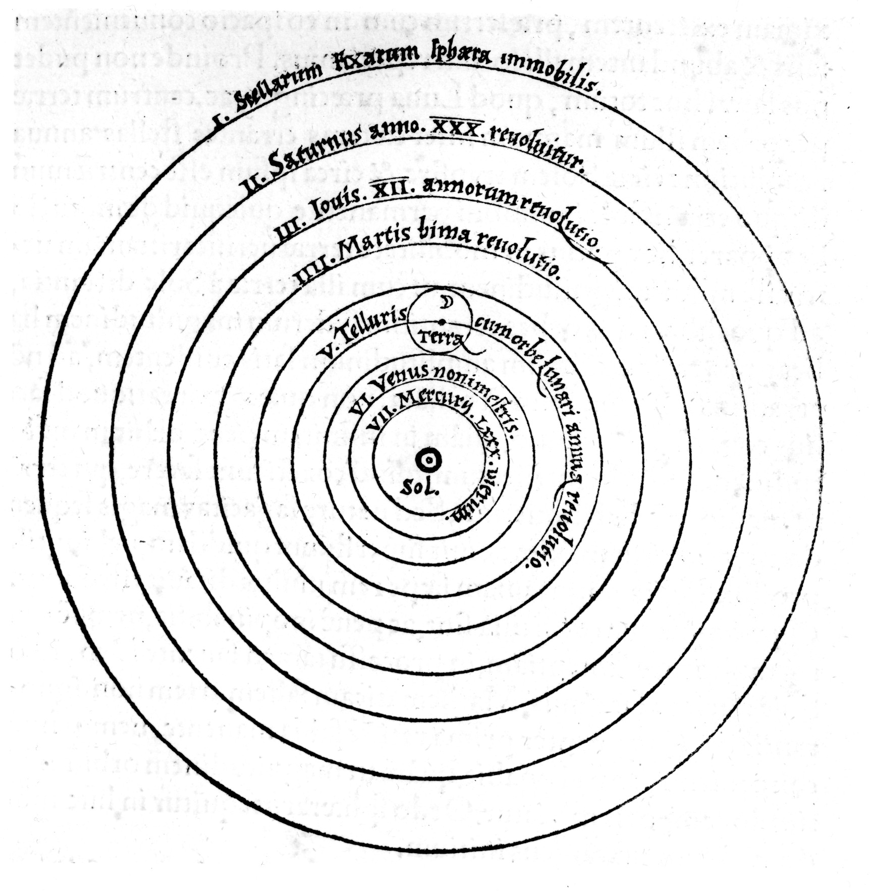

    

   | | | |
|-|-|-|
| **Question 1** | How many sentences have you heard (received as input) in your life? | A: Finitely many... 🤔 |
| **Question 2** | How many sentences could you *generate* (as output) right now? | A: Infinitely many... 🤯 |
| **Question 3** | How is this possible? | A: Our brains **infer** the "deep structure" of language, a **generative** model, from our linguistic inputs |

: {tbl-colwidths="[16, 42, 42]"}

---

* And which can be represented in matrix/vector form like

  $$
  \mathbf{X} = \begin{pmatrix}
  x_{1,1} & x_{1,2} & \cdots & x_{1,p} \\
  x_{2,1} & x_{2,2} & \cdots & x_{2,p} \\
  \vdots & \vdots & \ddots & \vdots \\
  x_{n,1} & x_{n,2} & \cdots & x_{n,p}
  \end{pmatrix},
  \mathbf{y} = \begin{pmatrix}
  y_1 \\ y_2 \\ \vdots \\ y_n
  \end{pmatrix}
  $$

---

Mikołaj Kopernik (Latinized as "Nicolaus Copernicus")

::: {.column width="33%"}

{fig-align="center" width="200"}

:::

---