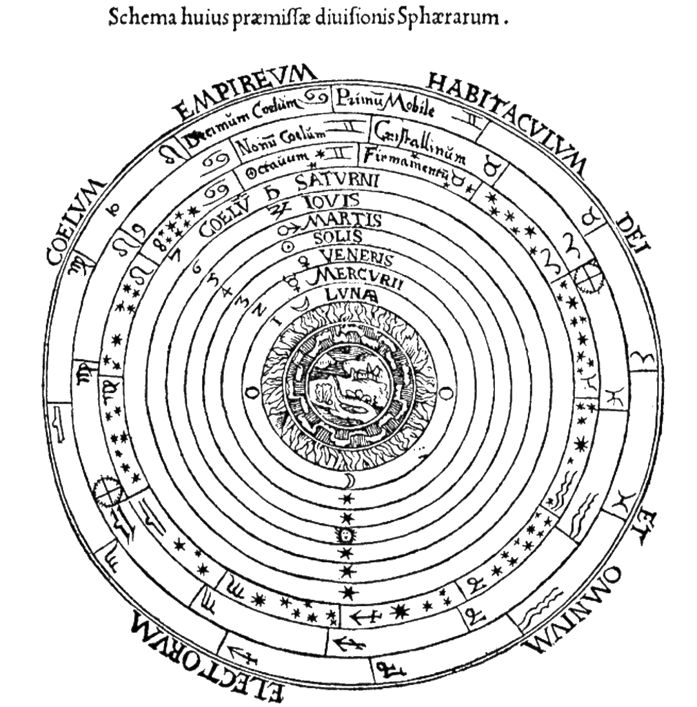
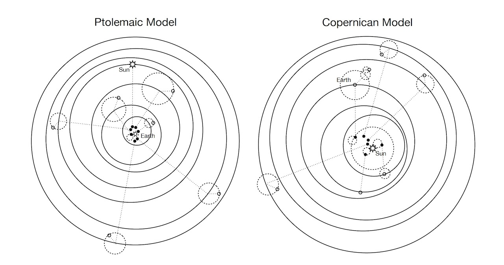
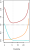
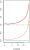
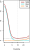

::: {.content-visible unless-format="revealjs"}

<center class='mb-3'>
<a class="h2" href="./slides.html" target="_blank">Open slides in new tab &rarr;</a>
</center>

:::

# What Does It Mean to *Learn?* {data-stack-name="Learning"}

*Spoiler: For both humans **and** computers,*

<center>

**learning $\neq$ memorization!**

</center>

::: {.hidden}

```{python}
#| label: py-imports
import pandas as pd
import numpy as np
import matplotlib.pyplot as plt
import seaborn as sns
import patchworklib as pw
import statsmodels.formula.api as smf
```



:::

## Memorizing vs. Learning {.smaller .crunch-title .title-11 .crunch-quarto-figure .crunch-ul .code-black .table-crunch-td .text-65 .crunch-li-8 .crunch-quarto-layout-panel}

<table>
<colgroup>
  <col style="width: 16%;"></col>
  <col style="width: 36%;"></col>
  <col style="width: 48%;"></col>
</colgroup>
<tbody>
<tr>
  <td class='tdvc'>**Question 1**</td>
  <td class='tdvc'>How many sentences have you *heard* (as input) in your life?</td>
  <td class='tdvc'>**Answer:** Finitely many... 🤔</td>
</tr>
<tr>
  <td class='tdvc'>**Question 2**</td>
  <td class='tdvc'>How many sentences could you *generate* (as output) right now?</td>
  <td class='tdvc'>**Answer:** Infinitely many... 🤯<br><span style='font-size: 75%;'>*("My favorite number is 1", "My favorite number is 2", ...)*</span></td>
</tr>
<tr>
  <td class='tdvc'>**Question 3**</td>
  <td class='tdvc'>How is this possible?</td>
  <td class='tdvc'>**Answer:** Our brains **infer** the "deep structure" of language, a **generative** model, from our linguistic inputs</td>
</tr>
</tbody>
</table>

:::: {layout="[42,58]"}
::: {#syntax-left .table-nolines .table-80}

<center>

Our brains learn a **grammar**...

| | | |
|-|-|-|
| S | $\rightarrow$ | NP VP |
| NP | $\rightarrow$ | DetP N \| AdjP NP |
| VP | $\rightarrow$ | V NP |
| AdjP | $\rightarrow$ | Adj \| Adv AdjP |
| N | $\rightarrow$ | `frog` \| `tadpole` |
| V | $\rightarrow$ | `sees` \| `likes` |
| Adj | $\rightarrow$ | `big` \| `small` \| `tiny` |
| Adv | $\rightarrow$ | `very` \| `immensely` |
| DetP | $\rightarrow$ | `a` \| `the` |

</center>

:::
::: {#syntax-right}

<center>

...For generating **arbitrary** (infinitely many!) sentences

</center>

{fig-align="center" width="330"}

:::
::::

## $\leadsto$ Our Goal This Semester {.crunch-title .text-85}

::: {.callout-tip .force-fw title="The Goal of Statistical Learning (V1)"}

<table>
<colgroup>
  <col style="width: 55%;"></col>
  <col style="width: 45%;"></col>
</colgroup>
<thead>
<tr>
  <th>**Given...**</th>
  <th>**Find...**</th>
</tr>
</thead>
<tbody>
<tr>
<td class='tdvc'>
* A **dataset** $\mathfrak{D} = ((\mathbf{x}_1, y_1), (\mathbf{x}_2, y_2), \ldots, (\mathbf{x}_n, y_n))$<br>*where $\mathbf{x}_i$ is a vector of **attributes** of $i$ and $y_i$ is a **label** (thing we want to learn to predict) for $i$*
* Which we view as one **sample** from a **Data-Generating Process (DGP)**: $\mathfrak{D} \sim \mathcal{D}$

</td>
<td class='tdvc'>

* A **function** $\widehat{y} = f(\mathbf{x})$ ✅
* That best **predicts $y$** for values of $\mathbf{x}$ ✅
* For data that has **not yet been observed** 😳❓

</td>
</tr>
</tbody>
</table>

:::

::: {#matrix-note style="font-size: 60%;"}

*Note that we'll often think of the dataset $\mathfrak{D}$ as being in matrix/vector form:*

$$
\mathbf{X} = \begin{pmatrix}
\mathbf{x}_1 \\ \mathbf{x}_2 \\ \vdots \\ \mathbf{x}_n
\end{pmatrix}
=
\underbrace{
  \begin{pmatrix}
x_{1,1} & x_{1,2} & \cdots & x_{1,p} \\
x_{2,1} & x_{2,2} & \cdots & x_{2,p} \\
\vdots & \vdots & \ddots & \vdots \\
x_{n,1} & x_{n,2} & \cdots & x_{n,p}
\end{pmatrix}
}_{n \times p \textbf{ Feature Matrix}}
,
\mathbf{y} = 
\underbrace{ 
  \begin{pmatrix}
y_1 \\ y_2 \\ \vdots \\ y_n
\end{pmatrix}
}_{\mathclap{\text{Length }n \text{ Label Vector}}}
$$

:::

## Why "Not Yet Observed"? (Real Data!) {.smaller .crunch-title .title-11 .table-60 .crunch-quarto-figure}

```{python}
#| label: chns-load
chns_df = pd.read_csv("data/chns_2000_2011.csv")
# First use statmodels to get the intercept and slope for pop
height_model_result = smf.ols(
  formula='height_cm_2011 ~ daily_calories_2000',
  data=chns_df
).fit()
ols_params = height_model_result.params
ols_int = ols_params['Intercept']
ols_slope = ols_params['daily_calories_2000']
x_mean = chns_df['daily_calories_2000'].mean()
ols_at_mean = ols_int + ols_slope * x_mean
chns_df.head(4)
```

:::: {.columns}
::: {.column width="50%"}

```{python}
#| label: chns-plot
#| fig-align: center
cal_label = "Daily Calories (3-Day Average), 2000"
height_label = "Height (cm), 2011"
ax = pw.Brick(figsize=(3.5,1.75))
height_plot = sns.regplot(
  chns_df,
  x='daily_calories_2000', y='height_cm_2011',
  ci=None,
  color='black',
  scatter_kws={'s': 2},
  line_kws=dict(color='#E69F00'),
  ax=ax
);
ax.set_title(f"Unobservable Population");
ax.set_xlabel(cal_label);
ax.set_ylabel(height_label);
ax
```

:::
::: {.column width="50%"}

```{python}
#| label: chns-sample-plot
#| fig-align: center
sample_size = 30
num_samples = 10
sample_dfs = []
seed_start = 5310
for cur_seed in range(seed_start, seed_start+num_samples):
  cur_sample_df = chns_df.sample(n = sample_size, random_state=cur_seed)
  cur_sample_df['sample_num'] = cur_seed - seed_start
  sample_dfs.append(cur_sample_df)
combined_df = pd.concat(sample_dfs, ignore_index=True)
# frame = pw.Brick(figsize=(4,3))
sample_plot = sns.lmplot(
  combined_df,
  x='daily_calories_2000', y='height_cm_2011',
  hue='sample_num', ci=None,
  # palette=sns.color_palette("light:#5A9"),
  palette='Greys',
  aspect=1.67, height=3,
  scatter_kws={'alpha': 0.1},
  truncate=False,
  legend=None,
);
sample_plot.ax.axline(
  xy1=(x_mean,ols_at_mean),
  slope=ols_slope,
  color='#E69F00',
  lw=2,
)
sample_plot.ax.set_title(f"{num_samples} Observed Samples (n = {sample_size} Each)");
sample_plot.set_xlabels(cal_label);
sample_plot.set_ylabels(height_label);
plt.show()
```

:::
::::

Which line is "correct"? We don't know! Samples may not arrive until **the future!**

# Statistical Modeling {data-stack-name="Modeling"}

## Scientific Models {.smaller .crunch-title .title-12 .crunch-quarto-figure}

:::: {layout="[1,2]" layout-valign="center"}
::: {.column width="50%"}

{#fig-aristarchus fig-align="center" width="200" .lightbox}

![Cassini (1659): planets *don't* travel in circles [@arago_astronomie_1854]](images/cassini.jpg){#fig-arago fig-align="center" width="200" .lightbox}

:::
::: {.column width="50%"}

**Ptolemaic model**: wrong? or just "less good" than **Copernican model**? How so?^[For reasons we'll discuss soon, Ptolemy's model often [outperforms](https://inference-review.com/article/ptolemy-versus-copernicus) Copernicus' on **prediction** tasks!]

{fig-align="center" width="100%"}

:::
::::

## Prediction vs. Understanding {.smaller}

```{=html}
<div id="ptolemy" style="height: 500px;">
<div id="canvases">
  <canvas id="traceCanvas"></canvas>
  <canvas id="canvas"></canvas>
</div>
<div id="buttondiv">
  <button data-inline="true" id="play-button" type="button">
    <i class="bi bi-play-fill"></i></span>
  </button>
  <button data-inline="true" id="reset" type="button">
      <i class='bi bi-arrow-clockwise'></i></span>
  </button>
  <button data-inline="true" id="trace" type="button">Path</button>
  <button data-inline="true" id="line_of_sight" type="button">Line of Sight</button>
</div>
</div>
```

<center>

*Adapted from [Michael Fowler's Lecture Notes](https://galileo.phys.virginia.edu/~mf1i/home.html)*

</center>

# Bias-Variance Tradeoff {data-stack-name="Bias-Variance Tradeoff"}

## Why *Statistical* Learning?

* Answer: Statistical theory provides us with **guarantees** about (e.g.) convergence or unbiasedness of our estimates
* Example next week: regression line estimated via OLS is **Best Linear Unbiased Estimator (BLUE)**
* As we move from **linear** $\leadsto$ **non-linear** models we start losing guarantees like *"This method produces the best estimate of $\underline{\hspace{40mm}}$"*

## Bias-Variance Decomposition {.math-80}

Model errors can be **decomposed** into three components:

<i class='bi bi-1-circle'></i> Model **bias**: Mismatch between DGP and model prediction

<i class='bi bi-2-circle'></i> Model **variance**: Sensitivity to re-draws from DGP

<i class='bi bi-3-circle'></i> **Unavoidable** error inherent in the DGP

$$
\mathbb{E}\mkern-4mu\left[ \left( y_0 - \widehat{f}(x_0) \right)^2 \right] = \left[ \text{Bias}\mkern-2mu\left( \hat{f}(x_0) \right) \right]^2 + \text{Var}\mkern-2mu\left[ \hat{f}(x_0) \right] + \text{Var}[\varepsilon]
$$

*(@james_introduction_2023, pg. 32!)*

## Consequence: "No Free Lunch"! {.smaller .crunch-title .crunch-quarto-figure .crunch-quarto-layout-panel .text-65}

:::: {.columns}
::: {.column width="33%"}

<center>

<i class='bi bi-1-circle'></i> True DGP: Polynomial

</center>

{fig-align="center" width="85%"}

:::
::: {.column width="33%"}

<center>

<i class='bi bi-2-circle'></i> True DGP: Linear

</center>

{fig-align="center" width="85%"}

:::
::: {.column width="34%"}

<center>

<i class='bi bi-3-circle'></i> True DGP: Highly Nonlinear

</center>

{fig-align="center" width="83%"}

:::
::::

Squared bias (blue), variance (orange), unavoidable error (dashed line), and test MSE (red) for the three data sets in Chapter 1 of @james_introduction_2023, pg. 33

## References

::: {#refs}
:::
