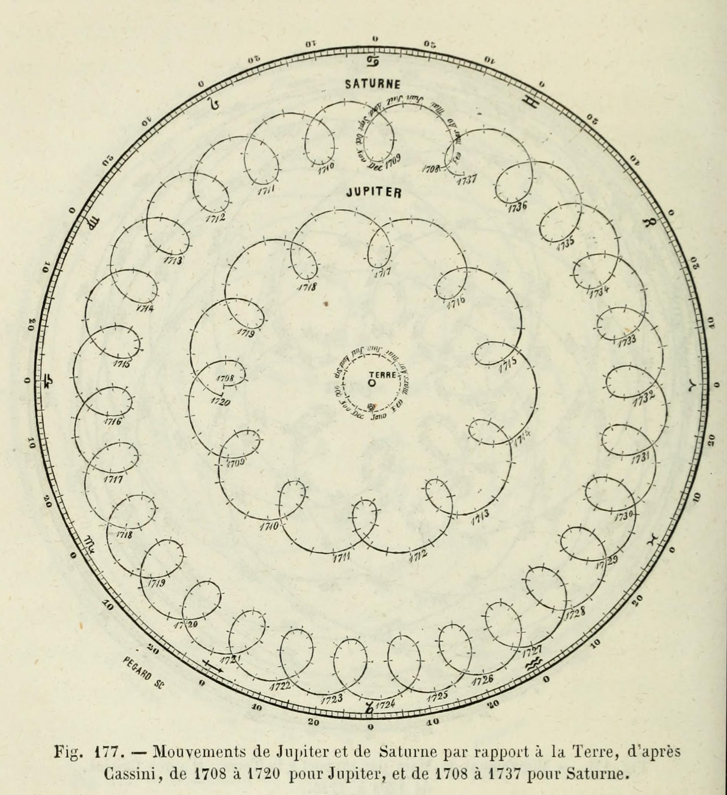
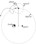

::: {.content-visible unless-format="revealjs"}

<center class='mb-3'>
<a class="h2" href="./slides.html" target="_blank">Open slides in new tab &rarr;</a>
</center>

:::

# What Does It Mean to *Learn?* {data-stack-name="Learning"}

## Memorizing vs. Learning {.smaller .crunch-title .title-11 .crunch-quarto-figure .crunch-ul .code-black .table-crunch-td .text-65 .crunch-li-8 .crunch-quarto-layout-panel}

<table>
<colgroup>
    <col style="width: 16%;">
    <col style="width: 36%;">
    <col style="width: 48%;">
  </colgroup>
<tbody>
<tr>
  <td class='tdvc'>**Question 1**</td>
  <td class='tdvc'>How many sentences have you *heard* (as input) in your life?</td>
  <td class='tdvc'>**Answer:** Finitely many... 🤔</td>
</tr>
<tr>
  <td class='tdvc'>**Question 2**</td>
  <td class='tdvc'>How many sentences could you *generate* (as output) right now?</td>
  <td class='tdvc'>**Answer:** Infinitely many... 🤯<br><span style='font-size: 75%;'>*("My favorite number is 1", "My favorite number is 2", ...)*</span></td>
</tr>
<tr>
  <td class='tdvc'>**Question 3**</td>
  <td class='tdvc'>How is this possible?</td>
  <td class='tdvc'>**Answer:** Our brains **infer** the "deep structure" of language, a **generative** model, from our linguistic inputs</td>
</tr>
</tbody>
</table>

:::: {layout="[42,58]"}
::: {#syntax-left .table-nolines .table-80}

<center>

Our brains learn a **syntax**...

| | | |
|-|-|-|
| S | $\rightarrow$ | NP VP |
| NP | $\rightarrow$ | DetP N \| AdjP NP |
| VP | $\rightarrow$ | V NP |
| AdjP | $\rightarrow$ | Adj \| Adv AdjP |
| N | $\rightarrow$ | `frog` \| `tadpole` |
| V | $\rightarrow$ | `sees` \| `likes` |
| Adj | $\rightarrow$ | `big` \| `small` \| `tiny` |
| Adv | $\rightarrow$ | `very` \| `immensely` |
| DetP | $\rightarrow$ | `a` \| `the` |

</center>

:::
::: {#syntax-right}

<center>

...For generating **arbitrary** (infinitely many!) sentences

</center>

{fig-align="center" width="330"}

:::
::::

## Scientific Models {.smaller .crunch-title .title-12}

**Ptolemaic model**: wrong? or just "less good" than **Copernican model**? How so?^[Oddly enough, Ptolemy's model often [outperformed](https://inference-review.com/article/ptolemy-versus-copernicus) Copernicus' on **prediction** tasks!]

:::: {layout="[1,1,1,1]" layout-valign="center"}
::: {.column width="33%"}

{fig-align="center" width="200"}

:::
::: {.column width="33%"}

{fig-align="center" width="200"}

:::
::: {.column width="33%"}

{fig-align="center" width="200"}

:::
::: {.column width="33%"}

Mikołaj Kopernik (Latinized as "Nicolaus Copernicus")

{fig-align="center" width="200"}

:::
::::

## Prediction vs. Understanding {.smaller}

```{=html}
<div id="ptolemy" style="height: 500px;">
<div id="canvases">
  <canvas id="traceCanvas"></canvas>
  <canvas id="canvas"></canvas>
</div>
<div id="buttondiv">
  <button data-inline="true" id="play-button" type="button">
    <i class="bi bi-play-fill"></i></span>
  </button>
  <button data-inline="true" id="reset" type="button">
      <i class='bi bi-arrow-clockwise'></i></span>
  </button>
  <button data-inline="true" id="trace" type="button">Path</button>
  <button data-inline="true" id="line_of_sight" type="button">Line of Sight</button>
</div>
</div>
```

<center>

*Adapted from [Michael Fowler's Lecture Notes](https://galileo.phys.virginia.edu/~mf1i/home.html)*

</center>

## 5000 $\leadsto$ 5300

::: {.callout-tip .r-fit-text title="<i class='bi bi-info-circle'></i> The Goal of Statistical Learning" icon="false"}

Find...

* A function $\widehat{y} = f(x)$ ✅
* That best predicts $Y$ for given values of $X$ ✅
* For data that has not yet been observed! 😳❓

:::

# Why *Statistical* Learning? {data-stack-name="Statistical Learning"}

## Guarantees!

# Beyond Statistical Learning {data-stack-name="Beyond Statistical Learning"}

## References

::: {#refs}
:::
