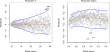

::: {.content-visible unless-format="revealjs"}

<center class='mb-3'>
<a class="h2" href="./slides.html" target="_blank">Open slides in new tab &rarr;</a>
</center>

:::

# Schedule {.smaller .small-title .crunch-title .crunch-callout data-name="Schedule"}

Today's Planned Schedule:

| | Start | End | Topic |
|:- |:- |:- |:- |
| **Lecture** | 6:30pm | 7:10pm | [Simple Linear Regression &rarr;](#linear-regression) |
| | 7:10pm | 7:30pm | [Deriving the OLS Solution &rarr;](#deriving-the-least-squares-estimate) |
| | 7:30pm | 8:00pm | [Interpreting OLS Output &rarr;](#interpreting-output) |
| **Break!** | 8:00pm | 8:10pm | |
| | 8:10pm | 8:30pm | [Quiz Review &rarr;](#quiz-review) |
| | 8:30pm | 9:00pm | Quiz 2! |

: {tbl-colwidths="[12,12,12,64]"}

# Linear Regression {data-stack-name="Linear Regression" .title-12 .crunch-title .crunch-ul .crunch-li-8}

* What happens to my **dependent variable** $Y$ when my **independent variable** $X$ increases by **1 unit**?
* Keep the **goal** in front of your mind:

  ::: {.callout-tip .r-fit-text title="<i class='bi bi-bullseye'></i> The Goal of Regression" icon="false"}

  **Find a line $\widehat{y} = mx + b$ that best predicts $Y$ for given values of $X$**

  :::

::: {#sanity-notes style="font-size: 67%"}

* *Sanity Note 1*: <i class='bi bi-bullseye'></i> $\Rightarrow$ measuring error via **vertical** distance from line
* *Sanity Note 2:* <i class='bi bi-bullseye'></i> $\Rightarrow$ modeling distribution of $\boxed{Y \mid X}$, not $(X,Y)$!
  * Predicting $Y$ from $X$ ***and*** $X$ from $Y$ $\Rightarrow$ **principal component line $\neq$ regression**!

:::

::: {.hidden}

```{r}
#| label: r-source-globals
source("../dsan-globals/_globals.r")
set.seed(5300)
```

:::




## How Do We Define "Best"? {.smaller .crunch-title .crunch-ul .crunch-quarto-figure .crunch-img .crunch-li-8}

* Intuitively, two different ways to measure **how well a line fits the data**:

::: {layout="[1,1]" layout-valign="center"}

```{r}
#| label: fig-pc-line
#| fig-width: 6
#| warning: false
#| fig-cap: The line that minimizes blue distances does **not** predict $Y$ as well as regression line, despite intuitive appeal!
library(tidyverse)
set.seed(5321)
N <- 11
x <- seq(from = 0, to = 1, by = 1 / (N - 1))
y <- x + rnorm(N, 0, 0.2)
mean_y <- mean(y)
spread <- y - mean_y
df <- tibble(x = x, y = y, spread = spread)
ggplot(df, aes(x=x, y=y)) +
  geom_abline(slope=1, intercept=0, linetype="dashed", color=cbPalette[1], linewidth=g_linewidth*1.5) +
  geom_segment(xend=(x+y)/2, yend=(x+y)/2, linewidth=g_linewidth*2, color=cbPalette[2]) +
  geom_point(size=g_pointsize) +
  coord_equal() +
  xlim(0, 1) + ylim(0, 1) +
  dsan_theme("half") +
  labs(
    title = "Principal Component Line"
  )
```

```{r}
#| label: fig-reg-line
#| fig-width: 6
#| warning: false
#| fig-cap: The line that minimizes green distances **optimally** predicts $Y$ from $X$, in a mathematically-provable sense!
ggplot(df, aes(x=x, y=y)) +
  geom_abline(slope=1, intercept=0, linetype="dashed", color=cbPalette[1], linewidth=g_linewidth*1.5) +
  geom_segment(xend=x, yend=x, linewidth=g_linewidth*2, color=cb_palette[3]) +
  geom_point(size=g_pointsize) +
  coord_equal() +
  xlim(0, 1) + ylim(0, 1) +
  dsan_theme("half") +
  labs(
    title = "Regression Line"
  )
```

:::

::: {.aside}
On the difference between these two lines, and why it matters, I cannot recommend @gelman_data_2007 enough!
:::


## Principal Component Analysis {.smaller .crunch-title .crunch-ul .shift-footnotes-20 .crunch-li-8}

* **Principal Component Line** can be used to **project** the data onto its **dimension of highest variance** (recap from 5000!)
* More simply: PCA can **discover** meaningful axes in data (**unsupervised** learning / **exploratory** data analysis settings)

```{r}
#| label: gdp-plot
#| warning: false
#| fig-width: 10
#| fig-height: 4
library(readr)
library(ggplot2)
gdp_df <- read_csv("assets/gdp_pca.csv")

dist_to_line <- function(x0, y0, a, c) {
    numer <- abs(a * x0 - y0 + c)
    denom <- sqrt(a * a + 1)
    return(numer / denom)
}
# Finding PCA line for industrial vs. exports
x <- gdp_df$industrial
y <- gdp_df$exports
lossFn <- function(lineParams, x0, y0) {
    a <- lineParams[1]
    c <- lineParams[2]
    return(sum(dist_to_line(x0, y0, a, c)))
}
o <- optim(c(0, 0), lossFn, x0 = x, y0 = y)
ggplot(gdp_df, aes(x = industrial, y = exports)) +
    geom_point(size=g_pointsize/2) +
    geom_abline(aes(slope = o$par[1], intercept = o$par[2], color="pca"), linewidth=g_linewidth, show.legend = TRUE) +
    geom_smooth(aes(color="lm"), method = "lm", se = FALSE, linewidth=g_linewidth, key_glyph = "blank") +
    scale_color_manual(element_blank(), values=c("pca"=cbPalette[2],"lm"=cbPalette[1]), labels=c("Regression","PCA")) +
    dsan_theme("half") +
    remove_legend_title() +
    labs(
      title = "PCA Line vs. Regression Line",
	    x = "Industrial Production (% of GDP)",
	    y = "Exports (% of GDP)"
    )
```

::: {.aside}
See [this amazing blog post](https://juliasilge.com/blog/un-voting/) using PCA, with 2 dimensions, to explore UN voting patterns!
:::

## Create Your Own Dimension!

```{r}
#| label: pca-plot
#| warning: false
ggplot(gdp_df, aes(pc1, .fittedPC2)) +
    geom_point(size = g_pointsize/2) +
    geom_hline(aes(yintercept=0, color='PCA Line'), linetype='solid', size=g_linesize) +
    geom_rug(sides = "b", linewidth=g_linewidth/1.2, length = unit(0.1, "npc"), color=cbPalette[3]) +
    expand_limits(y=-1.6) +
    scale_color_manual(element_blank(), values=c("PCA Line"=cbPalette[2])) +
    dsan_theme("full") +
    remove_legend_title() +
    labs(
      title = "Exports vs. Industrial Production in Principal Component Space",
      x = "First Principal Component (Dimension of Greatest Variance)",
      y = "Second Principal Component"
    )
```

## ...And Use It for EDA

```{r}
#| label: pca-facet-plot
#| warning: false
library(dplyr)
library(tidyr)
plot_df <- gdp_df %>% select(c(country_code, pc1, agriculture, military))
long_df <- plot_df %>% pivot_longer(!c(country_code, pc1), names_to = "var", values_to = "val")
long_df <- long_df |> mutate(
  var = case_match(
    var,
    "agriculture" ~ "Agricultural Production",
    "military" ~ "Military Spending"
  )
)
ggplot(long_df, aes(x = pc1, y = val, facet = var)) +
    geom_point() +
    geom_smooth(method=lm, formula='y ~ x') +
    facet_wrap(vars(var), scales = "free") +
	dsan_theme("full") +
	labs(
		x = "\"Industrial-Export Dimension\" (First PC)",
		y = "% of GDP"
	)
```

## But in Our Case... {.crunch-title .crunch-ul .text-90}

* $x$ and $y$ dimensions **already have meaning**, and we have a **hypothesis** about effect of $x$ on $y$!

::: {.callout-tip title="The Regression Hypothesis $\mathcal{H}_{\text{reg}}$"}
Given data $(X, Y)$, we estimate $\widehat{y} = \widehat{\beta}_0 + \widehat{\beta}_1x$, hypothesizing that:

* Starting from $y = \underbrace{\widehat{\beta}_0}_{\mathclap{\text{Intercept}}}$ when $x = 0$,
* An **increase** of $x$ by **1 unit** is associated with an **increase** of $y$ by **$\underbrace{\widehat{\beta}_1}_{\mathclap{\text{Coefficient}}}$ units**
:::

* We want to measure **how well** our line predicts $y$ for any given $x$ value $\implies$ **vertical distance** from regression line

## Example: Advertising Effects {.smaller .title-12 .crunch-title .crunch-ul}

* **Independent variable**: \$ put into advertisements; **Dependent variable**: Sales
* **Goal 1**: *Predict* sales for a given allocation
* **Goal 2**: *Infer* best allocation for a given advertising budget (more simply: a new $1K appears! Where should we invest it?)

```{r}
#| label: ad-plots
#| warning: false
#| fig-align: center
library(tidyverse)
ad_df <- read_csv("assets/Advertising.csv") |> rename(id=`...1`)
long_df <- ad_df |> pivot_longer(-c(id, sales), names_to="medium", values_to="allocation")
long_df |> ggplot(aes(x=allocation, y=sales)) +
  geom_point() +
  facet_wrap(vars(medium), scales="free_x") +
  geom_smooth(method='lm', formula="y ~ x") +
  theme_dsan() +
  labs(
    x = "Allocation ($1K)",
    y = "Sales (1K Units)"
  )
```

## Simple Linear Regression {.smaller .crunch-title .crunch-ul .crunch-math}

* For now, we treat **Newspaper**, **Radio**, **TV** advertising separately: how much do **sales** increase per $1 into [medium]? (Later we'll consider them jointly: multiple regression)

:::: {.columns}
::: {.column width="50%"}

<center>

**Our model**:

</center>

$$
Y = \underbrace{\param{\beta_0}}_{\mathclap{\text{Intercept}}} + \underbrace{\param{\beta_1}}_{\mathclap{\text{Slope}}}X + \varepsilon
$$

:::
::: {.column width="50%"}

<center>

...Generates **predictions** via:

</center>

$$
\widehat{y} = \underbrace{\widehat{\beta}_0}_{\mathclap{\small\begin{array}{c}\text{Estimated} \\[-5mm] \text{intercept}\end{array}}} ~+~ \underbrace{\widehat{\beta}_1}_{\mathclap{\small\begin{array}{c}\text{Estimated} \\[-4mm] \text{slope}\end{array}}}\cdot x
$$

:::
::::

* Note how these predictions will be **wrong** (unless the data is perfectly linear)
* We've accounted for this in our model (by including $\varepsilon$ term)!
* But, we'd like to find estimates $\widehat{\beta}_0$ and $\widehat{\beta}_1$ that produce the **"least wrong" predictions**: motivates focus on **residuals $\widehat{\varepsilon}_i$...**

$$
\widehat{\varepsilon}_i = \underbrace{y_i}_{\mathclap{\small\begin{array}{c}\text{Real} \\[-5mm] \text{label}\end{array}}} - \underbrace{\widehat{y}_i}_{\mathclap{\small\begin{array}{c}\text{Predicted} \\[-5mm] \text{label}\end{array}}}
= \underbrace{y_i}_{\mathclap{\small\begin{array}{c}\text{Real} \\[-5mm] \text{label}\end{array}}} - \underbrace{
  \left(
    \widehat{\beta}_0 + \widehat{\beta}_1 \cdot x
  \right)
}_{\text{\small{Predicted label}}}
$$

## Least Squares: Minimizing Residuals {.smaller .crunch-title .title-11 .crunch-quarto-figure .crunch-p .crunch-quarto-layout-panel .crunch-img}

What can we **optimize** to ensure these residuals are as small as possible?

:::: {layout="[65,35]" layout-valign="center"}
::: {.column width="65%"}

```{r}
#| label: large-resids-plot
#| fig-height: 4
N <- 21
x <- seq(from = 0, to = 1, by = 1 / (N - 1))
y <- x + rnorm(N, 0, 0.25)
mean_y <- mean(y)
spread <- y - mean_y
sim_lg_df <- tibble(x = x, y = y, spread = spread)
sim_lg_df |> ggplot(aes(x=x, y=y)) +
  geom_abline(slope=1, intercept=0, linetype="dashed", color=cbPalette[1], linewidth=g_linewidth) +
  # geom_segment(xend=x, yend=x, linewidth=g_linewidth*2, color=cbPalette[2]) +
  geom_segment(aes(xend=x, yend=x, color=ifelse(y>x,"Positive","Negative")), linewidth=1.5*g_linewidth) +
  geom_point(size=g_pointsize) +
  # coord_equal() +
  theme_dsan("half") +
  scale_color_manual("Spread", values=c("Positive"=cbPalette[3],"Negative"=cbPalette[6]), labels=c("Positive"="Positive","Negative"="Negative"))
```

:::
::: {.column width="35%"}

Sum?

```{r}
#| label: large-resids-sum-of-spread
large_sum <- sum(sim_lg_df$spread)
writeLines(fmt_decimal(large_sum))
```

Sum of Squares?

```{r}
#| label: large-resids-sum-of-spread-squared
large_sqsum <- sum((sim_lg_df$spread)^2)
writeLines(fmt_decimal(large_sqsum))
```

Sum of absolute vals?

```{r}
#| label: large-resids-sum-of-abs
large_abssum <- sum(abs(sim_lg_df$spread))
writeLines(fmt_decimal(large_abssum))
```

:::
::::

:::: {layout="[65,35]" layout-valign="center"}
::: {.column width="65%"}

```{r}
#| label: small-resids-plot
#| fig-height: 4
N <- 21
x <- seq(from = 0, to = 1, by = 1 / (N - 1))
y <- x + rnorm(N, 0, 0.05)
mean_y <- mean(y)
spread <- y - mean_y
sim_sm_df <- tibble(x = x, y = y, spread = spread)
sim_sm_df |> ggplot(aes(x=x, y=y)) +
  geom_abline(slope=1, intercept=0, linetype="dashed", color=cbPalette[1], linewidth=g_linewidth) +
  # geom_segment(xend=x, yend=x, linewidth=g_linewidth*2, color=cbPalette[2]) +
  geom_segment(aes(xend=x, yend=x, color=ifelse(y>x,"Positive","Negative")), linewidth=1.5*g_linewidth) +
  geom_point(size=g_pointsize) +
  # coord_equal() +
  theme_dsan("half") +
  scale_color_manual("Spread", values=c("Positive"=cbPalette[3],"Negative"=cbPalette[6]), labels=c("Positive"="Positive","Negative"="Negative"))
```

:::
::: {.column width="35%"}

Sum?

```{r}
#| label: small-resids-sum
small_rsum <- sum(sim_sm_df$spread)
writeLines(fmt_decimal(small_rsum))
```

Sum of Squares?

```{r}
#| label: small-resids-sum-of-squares
small_sqrsum <- sum((sim_sm_df$spread)^2)
writeLines(fmt_decimal(small_sqrsum))
```

Sum of absolute vals?

```{r}
#| label: small-resids-sum-of-abs
small_abssum <- sum(abs(sim_sm_df$spread))
writeLines(fmt_decimal(small_abssum))
```

:::
::::

## Why Not Absolute Value? {.smaller .crunch-title .crunch-code .crunch-ul .crunch-quarto-figure}

* Two feasible ways to prevent positive and negative residuals **cancelling out**:
  * [**Absolute error** $\left|y - \widehat{y}\right|$]{.cb1} or [**squared error** $\left( y - \widehat{y} \right)^2$]{.cb2}
* But remember: we're aiming to **minimize** 👀 these residuals; ghost of calculus past 😱
* We *minimize* by taking *derivatives*... which one is **differentiable** everywhere?

:::: {.columns}
::: {.column width="50%"}

```{r}
#| label: abs-x-plot
#| fig-height: 7
# Could use facet_grid() here, but it doesn't work too nicely with stat_function() :(
ggplot(data.frame(x=c(-4,4)), aes(x=x)) +
  stat_function(
    fun =~ abs(.x),
    linewidth=g_linewidth * 1.5,
    color=cb_palette[1],
  ) +
  dsan_theme("quarter") +
  labs(
    title="f(x) = |x|",
    y="f(x)"
  )
```

:::
::: {.column width="50%"}


```{r}
#| label: x2-plot
#| warning: false
#| fig-height: 7
library(latex2exp)
x2_label <- TeX("$f(x) = x^2$")
ggplot(data.frame(x=c(-4,4)), aes(x=x)) +
  stat_function(
    fun =~ .x^2,
    linewidth = g_linewidth * 1.5,
    color=cb_palette[2],
  ) +
  dsan_theme("quarter") +
  labs(
    title=x2_label,
    y="f(x)"
  )
```

:::
::::

## Outliers Penalized Quadratically {.smaller .crunch-title .crunch-ul .crunch-quarto-layout-panel}

* May feel arbitrary at first (we're "forced" to use squared error because of calculus?)
* It also has **important consequences** for "learnability" via gradient descent!

:::: {layout="[1,1]" layout-valign="center"}
::: {.column width="50%"}

```{r}
#| label: resid-quadratic-abs
#| fig-height: 8
library(latex2exp)
set.seed(5300)
slope <- 0.5
x_vals <- seq(from = -20, to = 20, length.out = 15)
N <- length(x_vals)
y_vals <- slope * x_vals + rnorm(N, 0, 5)
spread_vals <- y_vals - slope * x_vals
sim_lg_df <- tibble(
  x = x_vals, y = y_vals, spread = spread_vals
)
abs_sum <- round(sum(abs(sim_lg_df$spread)), 3)
abs_label <- TeX(paste0("$\\Sigma = ",abs_sum,"$"))
sim_lg_df |> ggplot(aes(x=x, y=y)) +
  geom_point(size=g_pointsize * 0.9) +
  geom_abline(
    slope=slope,
    intercept=0,
    linetype="dashed",
    color='black',
    linewidth=g_linewidth
  ) +
  geom_segment(
    aes(xend=x, yend=slope * x),
    arrow=arrow(
      angle=90,
      length=unit(0.125,'inches'),
      ends='both'
    ),
    linewidth=1.5*g_linewidth,
    color=cb_palette[7],
    alpha=0.9,
  ) +
  ylim(-15, 15) +
  xlim(-20, 27.5) +
  coord_equal() +
  theme_dsan(base_size=28) +
  labs(title="Absolute Penalties") +
  geom_text(
    data=data.frame(x=15, y=-10), label=abs_label,
    size=12
  )
```

:::
::: {.column width="50%"}

```{r}
#| label: resid-quadratic-squared
#| fig-height: 8
sq_sum <- round(sum((sim_lg_df$spread)^2), 3)
sq_label <- TeX(paste0("$\\Sigma = ",sq_sum,"$"))
sim_lg_df |> ggplot(aes(x=x, y=y)) +
  geom_point(size=g_pointsize * 0.9) +
  geom_abline(
    slope=slope,
    intercept=0,
    linetype="dashed",
    color='black',
    linewidth=g_linewidth
  ) +
  geom_rect(
    aes(
      xmin=x,
      xmax=x+abs(spread),
      ymin=ifelse(spread < 0, y, y - spread),
      ymax=ifelse(spread < 0, y - spread, y)
    ),
    color='black',
    fill=cb_palette[7],
    alpha=0.2,
  ) +
  ylim(-15, 15) +
  xlim(-20, 27.5) +
  coord_equal() +
  theme_dsan(base_size=30) +
  labs(title="Squared Penalties") +
  geom_text(
    data=data.frame(x=15, y=-10), label=sq_label,
    size=12
  )
```

:::
::::

## Key Features of Regression Line {.crunch-math .math-90}

* Regression line is **BLUE**: **B**est **L**inear **U**nbiased **E**stimator
* What exactly is it the "best" linear estimator of?

$$
\widehat{y} = \underbrace{\widehat{\beta}_0}_{\mathclap{\small\begin{array}{c}\text{Estimated} \\[-5mm] \text{intercept}\end{array}}} ~+~ \underbrace{\widehat{\beta}_1}_{\mathclap{\small\begin{array}{c}\text{Estimated} \\[-4mm] \text{slope}\end{array}}}\cdot x
$$

is chosen so that

::: {.smallmath}

$$
\widehat{\theta} = \left(\widehat{\beta}_0, \widehat{\beta}_1\right) = \argmin_{\beta_0, \beta_1}\left[ \sum_{x_i \in X} \left(~~\overbrace{\widehat{y}(x_i)}^{\mathclap{\small\text{Predicted }y}} - \overbrace{\expect{Y \mid X = x_i}}^{\small \text{Avg. }y\text{ when }x = x_i}\right)^{2~} \right]
$$

:::

## Where Did That $\mathbb{E}[Y \mid X = x_i]$ Come From? {.smaller .title-11}

* From our assumption that the irreducible **errors** $\varepsilon_i$ are **normally distributed** $\mathcal{N}(0, \sigma^2)$

](images/regression_normal_dist.jpg){fig-align="center"}

* Kind of an immensely important point, since it **gives us a hint for checking whether model assumptions hold**: spread around the regression line should be $\mathcal{N}(0, \sigma^2)$

## Heteroskedasticity {.smaller .crunch-title}

* If spread **increases** or **decreases** for larger $x$, for example, then $\varepsilon \nsim \mathcal{N}(0, \sigma^2)$

{fig-align="center"}

## But... What About Other Types of Vars? {.title-08 .crunch-title .text-90}

* 5000: you saw **nominal**, **ordinal**, **cardinal** vars
* 5100: you wrestled with **discrete** vs. **continuous** RVs
* Good News #1: Regression can handle **all** these types+more!
* Good News #2: Distinctions between **classification** and **regression** diminish as you learn fancier regression methods!
  * tldr: Predict continuous probabilities $\Pr(Y) \in [0,1]$ (regression), then guess 1 if $\Pr(Y) > 0.5$ (classification)
* By end of 5300 you should have something on your toolbelt for handling most cases like *"I want to do [regression / classification], but my data is [not cardinal+continuous]"*

# Deriving the Least Squares Estimate {data-stack-name="Deriving OLS"}

## A Sketch (HW is the Full Thing) {.smaller .crunch-title .crunch-ul}

* OLS for regression **without** intercept: Which [**line through origin**]{.boxed} best predicts $Y$?
* (Good practice + reminder of how **restricted** linear models are!)

$$
Y = \beta_1 X + \varepsilon
$$

```{r}
#| label: random-lines-origin
#| warning: false
library(latex2exp)
set.seed(5300)
# rand_slope <- log(runif(80, min=0, max=1))
# rand_slope[41:80] <- -rand_slope[41:80]
# rand_lines <- tibble::tibble(
#   id=1:80, slope=rand_slope, intercept=0
# )
# angles <- runif(100, -pi/2, pi/2)
angles <- seq(from=-pi/2, to=pi/2, length.out=50)
possible_lines <- tibble::tibble(
  slope=tan(angles), intercept=0
)
num_points <- 30
x_vals <- runif(num_points, 0, 1)
y0_vals <- 0.5 * x_vals + 0.25
y_noise <- rnorm(num_points, 0, 0.07)
y_vals <- y0_vals + y_noise
rand_df <- tibble::tibble(x=x_vals, y=y_vals)
title_exp <- TeX("Parameter Space ($\\beta_1$)")
# Main plot object
gen_lines_plot <- function(point_size=2.5) {
  lines_plot <- rand_df |> ggplot(aes(x=x, y=y)) +
    geom_point(size=point_size) +
    geom_hline(yintercept=0, linewidth=1.5) +
    geom_vline(xintercept=0, linewidth=1.5) +
    # Point at origin
    geom_point(data=data.frame(x=0, y=0), aes(x=x, y=y), size=4) +
    xlim(-1,1) +
    ylim(-1,1) +
    # coord_fixed() +
    theme_dsan_min(base_size=28)
  return(lines_plot)
}
main_lines_plot <- gen_lines_plot()
main_lines_plot +
  # Parameter space of possible lines
  geom_abline(
    data=possible_lines,
    aes(slope=slope, intercept=intercept, color='possible'),
    # linetype="dotted",
    # linewidth=0.75,
    alpha=0.25
  ) +
  # True DGP
  geom_abline(
    aes(
      slope=0.5,
      intercept=0.25,
      color='true'
    ), linewidth=1, alpha=0.8
  ) + 
  scale_color_manual(
    element_blank(),
    values=c('possible'="black", 'true'=cb_palette[2]),
    labels=c('possible'="Possible Fits", 'true'="True DGP")
  ) +
  remove_legend_title() +
  labs(
    title=title_exp
  )
```

## Evaluating with Residuals {.smaller}

:::: {.columns}
::: {.column width="50%"}

```{r}
#| label: possible-choice-1
#| warning: false
rc1_df <- possible_lines |> slice(n() - 14)
# Predictions for this choice
rc1_pred_df <- rand_df |> mutate(
  y_pred = rc1_df$slope * x,
  resid = y - y_pred
)
rc1_label <- TeX(paste0("Estimate 1: $\\beta_1 \\approx ",round(rc1_df$slope, 3),"$"))
rc1_lines_plot <- gen_lines_plot(point_size=5)
rc1_lines_plot +
  geom_abline(
    data=rc1_df,
    aes(intercept=intercept, slope=slope),
    linewidth=2,
    color=cb_palette[1]
  ) +
  geom_segment(
    data=rc1_pred_df,
    aes(x=x, y=y, xend=x, yend=y_pred),
    # color=cb_palette[1]
  ) +
  xlim(0, 1) + ylim(0, 1.5) +
  labs(
    title = rc1_label
  )
```

:::
::: {.column width="50%"}

```{r}
#| label: choice-1-resid
#| warning: false
gen_resid_plot <- function(pred_df) {
  rc_rss <- sum((pred_df$resid)^2)
  rc_resid_label <- TeX(paste0("Residuals: RSS $\\approx$ ",round(rc_rss,3)))
  rc_resid_plot <- pred_df |> ggplot(aes(x=x, y=resid)) +
    geom_point(size=5) +
    geom_hline(
      yintercept=0,
      color=cb_palette[1],
      linewidth=1.5
    ) +
    geom_segment(
      aes(xend=x, yend=0)
    ) +
    theme_dsan(base_size=28) +
    theme(axis.line.x = element_blank()) +
    ylim(-0.75, 0.25) +
    labs(
      title=rc_resid_label
    )
  return(rc_resid_plot)
}
rc1_resid_plot <- gen_resid_plot(rc1_pred_df)
rc1_resid_plot
```

:::
::::

:::: {.columns}
::: {.column width="50%"}

```{r}
#| label: possible-choice-2
#| warning: false
rc2_df <- possible_lines |> slice(n() - 9)
# Predictions for this choice
rc2_pred_df <- rand_df |> mutate(
  y_pred = rc2_df$slope * x,
  resid = y - y_pred
)
rc2_label <- TeX(paste0("Estimate 2: $\\beta_1 \\approx ",round(rc2_df$slope,3),"$"))
rc2_lines_plot <- gen_lines_plot(point_size=5)
rc2_lines_plot +
  geom_abline(
    data=rc2_df,
    aes(intercept=intercept, slope=slope),
    linewidth=2,
    color=cb_palette[3]
  ) +
  geom_segment(
    data=rc2_pred_df,
    aes(
      x=x, y=y, xend=x,
      # yend=ifelse(y_pred <= 1, y_pred, Inf)
      yend=y_pred
    )
    # color=cb_palette[1]
  ) +
  xlim(0, 1) + ylim(0, 1.5) +
  labs(
    title=rc2_label
  )
```

:::
::: {.column width="50%"}

```{r}
#| label: choice-2-resid
rc2_resid_plot <- gen_resid_plot(rc2_pred_df)
rc2_resid_plot
```

:::
::::

## Now the Math {.smaller}

$$
\begin{align*}
\beta_1^* = \overbrace{\argmin}^{\begin{array}{c} \text{\small{Find thing}} \\[-5mm] \text{\small{that minimizes}}\end{array}}_{\beta_1}\left[ \sum_{i=1}^{n}(y_i - \widehat{y}_i)^2 \right] = \argmin_{\beta_1}\left[ \sum_{i=1}^{n}(y_i - \beta_1x_i)^2 \right]
\end{align*}
$$

We can compute this derivative to obtain:

$$
\frac{\partial}{\partial\beta_1}\left[ \sum_{i=1}^{n}(\beta_1x_i - y_i)^2 \right] = \sum_{i=1}^{n}\frac{\partial}{\partial\beta_1}(\beta_1x_i - y_i)^2 = \sum_{i=1}^{n}2(\beta_1x_i - y_i)x_i
$$

And our first-order condition means that:

$$
\sum_{i=1}^{n}2(\beta_1^*x_i - y_i)x_i = 0 \iff \beta_1^*\sum_{i=1}^{n}x_i^2 = \sum_{i=1}^{n}x_iy_i \iff \boxed{\beta_1^* = \frac{\sum_{i=1}^{n}x_iy_i}{\sum_{i=1}^{n}x_i^2}}
$$

# Doing Things With Regression {data-stack-name="Interpreting Results"}

## Regression: `R` vs. `statsmodels` {.smaller .output-75}

:::: {.columns}
::: {.column width="45%"}

<center>
**In (Base) R: `lm()`**
</center>

```{r}
#| label: lin-reg-summary
#| echo: true
#| code-fold: show
lin_model <- lm(sales ~ TV, data=ad_df)
summary(lin_model)
```

General syntax:

``` {.r}
lm(
  dependent ~ independent + controls,
  data = my_df
)
```

:::
::: {.column width="55%"}

<center>
**In Python: `smf.ols()`**
</center>

```{python}
#| label: load-data-py
#| echo: false
import pandas as pd
ad_df = pd.read_csv("assets/Advertising.csv")
```

```{python}
#| label: lin-reg-py
#| echo: true
#| code-fold: show
import statsmodels.formula.api as smf
results = smf.ols("sales ~ TV", data=ad_df).fit()
print(results.summary(slim=True))
```

General syntax:

``` {.python}
smf.ols(
  "dependent ~ independent + controls",
  data = my_df
)
```

:::
::::

## Interpreting Output {.smaller}

:::: {.columns}
::: {.column width="50%"}

```{r}
#| label: mil-plot-intro
#| warning: false
library(tidyverse)
gdp_df <- read_csv("assets/gdp_pca.csv")
mil_plot <- gdp_df |> ggplot(aes(x=industrial, y=military)) +
  geom_point(size=0.5*g_pointsize) +
  geom_smooth(method='lm', formula="y ~ x", linewidth=1) +
  theme_dsan() +
  labs(
    title="Military Exports vs. Industrialization",
    x="Industrial Production (% of GDP)",
    y="Military Exports (% of All Exports)"
  )
```

```{r}
#| label: mil-plot
#| warning: false
#| fig-height: 8
mil_plot + theme_dsan("quarter")
```

:::
::: {.column width="50%"}

```{r}
#| label: mil-reg
#| warning: false
gdp_model <- lm(military ~ industrial, data=gdp_df)
summary(gdp_model)
```

:::
::::

## Zooming In: Coefficients {.table-75 .crunch-title}

::: {.coef-table}

|     |       Estimate | Std. Error | t value | Pr(>\|t\|) | |
|-:|:-:|-|-|-|-|
| <span class="cb1">**(Intercept)**</span> | [0.61969]{.cb1} |   [0.59526]{.cb1}  | [1.041]{.cb1 .bold}  |  [0.3010]{.cb1 .bold} |  |
| <span class="cb2">**industrial**</span>  | [0.05253]{.cb2}  |  [0.02019]{.cb2} |  [2.602]{.cb2 .bold} |  [0.0111]{.cb2 .bold}  | [*]{.cb2 .bold} |
| | <span class="coef-label">$\widehat{\beta}$</span> | <span class="coef-label">Uncertainty</span> | <span class="coef-label">Test stat $t$</span> | <span class="coef-label">How extreme is $t$?</span> | <span class="coef-label">Signif. Level</span> |

: {tbl-colwidths="[12,12,20,22,26,8]"}

:::

$$
\widehat{y} \approx \class{cb1}{\overset{\beta_0}{\underset{\small \pm 0.595}{0.620}}} +  \class{cb2}{\overset{\beta_1}{\underset{\small \pm 0.020}{0.053}}} \cdot x
$$

## Zooming In: Significance {.crunch-title .table-75 .crunch-details .crunch-quarto-figure}

::: {.coef-table}

|     |       Estimate | Std. Error | t value | Pr(>\|t\|) | |
|-:|:-:|-|-|-|-|
| <span class="cb1">**(Intercept)**</span> | [0.61969]{.cb1} |   [0.59526]{.cb1}  | [1.041]{.cb1 .bold}  |  [0.3010]{.cb1 .bold} |  |
| <span class="cb2">**industrial**</span>  | [0.05253]{.cb2}  |  [0.02019]{.cb2} |  [2.602]{.cb2 .bold} |  [0.0111]{.cb2 .bold}  | [*]{.cb2 .bold} |
| | <span class="coef-label">$\widehat{\beta}$</span> | <span class="coef-label">Uncertainty</span> | <span class="coef-label">Test stat $t$</span> | <span class="coef-label">How extreme is $t$?</span> | <span class="coef-label">Signif. Level</span> |

: {tbl-colwidths="[12,12,20,22,26,8]"}

:::

::: columns
::: {.column width="50%"}

```{r}
#| label: t-stat-intercept
#| fig-align: center
#| fig-height: 6
#| warning: false
library(ggplot2)
int_tstat <- 1.041
int_tstat_str <- sprintf("%.02f", int_tstat)
label_df_int <- tribble(
    ~x, ~y, ~label,
    0.25, 0.05, paste0("P(t > ",int_tstat_str,")\n= 0.3")
)
label_df_signif_int <- tribble(
    ~x, ~y, ~label,
    2.7, 0.075, "95% Signif.\nCutoff"
)
funcShaded <- function(x, lower_bound, upper_bound){
    y <- dnorm(x)
    y[x < lower_bound | x > upper_bound] <- NA
    return(y)
}
funcShadedIntercept <- function(x) funcShaded(x, int_tstat, Inf)
funcShadedSignif <- function(x) funcShaded(x, 1.96, Inf)
ggplot(data=data.frame(x=c(-3,3)), aes(x=x)) +
  stat_function(fun=dnorm, linewidth=g_linewidth) +
  geom_vline(aes(xintercept=int_tstat), linewidth=g_linewidth, linetype="dashed") +
  geom_vline(aes(xintercept = 1.96), linewidth=g_linewidth, linetype="solid") +
  stat_function(fun = funcShadedIntercept, geom = "area", fill = cbPalette[1], alpha = 0.5) +
  stat_function(fun = funcShadedSignif, geom = "area", fill = "grey", alpha = 0.333) +
  geom_text(label_df_int, mapping = aes(x = x, y = y, label = label), size = 10) +
  geom_text(label_df_signif_int, mapping = aes(x = x, y = y, label = label), size = 8) +
  # Add single additional tick
  scale_x_continuous(breaks=c(-2, 0, int_tstat, 2), labels=c("-2","0",int_tstat_str,"2")) +
  dsan_theme("quarter") +
  labs(
    title = "t Value for Intercept",
    x = "t",
    y = "Density"
  ) +
  theme(axis.text.x = element_text(colour = c("black", "black", cbPalette[1], "black")))
```

:::
::: {.column width="50%"}

```{r}
#| label: t-stat-coef
#| fig-align: center
#| fig-height: 6
#| warning: false
library(ggplot2)
coef_tstat <- 2.602
coef_tstat_str <- sprintf("%.02f", coef_tstat)
label_df_coef <- tribble(
    ~x, ~y, ~label,
    3.65, 0.06, paste0("P(t > ",coef_tstat_str,")\n= 0.01")
)
label_df_signif_coef <- tribble(
  ~x, ~y, ~label,
  1.05, 0.03, "95% Signif.\nCutoff"
)
funcShadedCoef <- function(x) funcShaded(x, coef_tstat, Inf)
ggplot(data=data.frame(x=c(-4,4)), aes(x=x)) +
  stat_function(fun=dnorm, linewidth=g_linewidth) +
  geom_vline(aes(xintercept=coef_tstat), linetype="dashed", linewidth=g_linewidth) +
  geom_vline(aes(xintercept=1.96), linetype="solid", linewidth=g_linewidth) +
  stat_function(fun = funcShadedCoef, geom = "area", fill = cbPalette[2], alpha = 0.5) +
  stat_function(fun = funcShadedSignif, geom = "area", fill = "grey", alpha = 0.333) +
  # Label shaded area
  geom_text(label_df_coef, mapping = aes(x = x, y = y, label = label), size = 10) +
  # Label significance cutoff
  geom_text(label_df_signif_coef, mapping = aes(x = x, y = y, label = label), size = 8) +
  coord_cartesian(clip = "off") +
  # Add single additional tick
  scale_x_continuous(breaks=c(-4, -2, 0, 2, coef_tstat, 4), labels=c("-4", "-2","0", "2", coef_tstat_str,"4")) +
  dsan_theme("quarter") +
  labs(
    title = "t Value for Coefficient",
    x = "t",
    y = "Density"
  ) +
  theme(axis.text.x = element_text(colour = c("black", "black", "black", "black", cbPalette[2], "black")))
```

:::
:::

## The Residual Plot {.crunch-title .crunch-images data-name="Diagnostics"}

::: columns
::: {.column width="50%"}

Recall **homoskedasticity** assumption: Given our model

  $$
  y_i = \beta_0 + \beta_1x_i + \varepsilon_i
  $$

the errors $\varepsilon_i$ **should not vary systematically with $i$**

Formally: $\forall i \left[ \Var{\varepsilon_i} = \sigma^2 \right]$

:::
::: {.column width="50%"}

```{r}
#| label: residual-plot
#| warning: false
library(broom)
gdp_resid_df <- augment(gdp_model)
ggplot(gdp_resid_df, aes(x = industrial, y = .resid)) +
    geom_point(size = g_pointsize/2) +
    geom_hline(yintercept=0, linetype="dashed") +
    dsan_theme("quarter") +
    labs(
      title = "Residual Plot for Military ~ Industrial",
      x = "Fitted Value",
      y = "Residual"
    )
```

```{r}
#| label: heteroskedastic
x <- 1:80
errors <- rnorm(length(x), 0, x^2/1000)
y <- x + errors
het_model <- lm(y ~ x)
df_het <- augment(het_model)
ggplot(df_het, aes(x = .fitted, y = .resid)) +
    geom_point(size = g_pointsize / 2) +
    geom_hline(yintercept = 0, linetype = "dashed") +
    dsan_theme("quarter") +
    labs(
        title = "Residual Plot for Heteroskedastic Data",
        x = "Fitted Value",
        y = "Residual"
    )
```

:::
:::

## Q-Q Plot

* If $(\widehat{y} - y) \sim \mathcal{N}(0, \sigma^2)$, points would lie on 45° line:

:::: {.columns}
::: {.column width="50%"}

```{r}
#| label: qq-plot-heteroskedastic
#| fig-height: 9
ggplot(df_het, aes(sample=.resid)) +
  stat_qq(size = g_pointsize/2) + stat_qq_line(linewidth = g_linewidth) +
  dsan_theme(base_size=30) +
  labs(
    title = "Q-Q Plot for Heteroskedastic Data",
    x = "Normal Distribution Quantiles",
    y = "Observed Data Quantiles"
  )
```

:::
::: {.column width="50%"}

```{r}
#| label: qq-plot-gdp
#| fig-height: 9
ggplot(gdp_resid_df, aes(sample=.resid)) +
  stat_qq(size = g_pointsize/2) + stat_qq_line(linewidth = g_linewidth) +
  dsan_theme(base_size=30) +
  labs(
    title = "Q-Q Plot for Industrial ~ Military Residuals",
    x = "Normal Distribution Quantiles",
    y = "Observed Data Quantiles"
  )
```

:::
::::

## Multiple Linear Regression

* Notation: $x_{i,j}$ = value of independent variable $j$ for person/observation $i$
* $M$ = total number of independent variables

$$
\widehat{y}_i = \beta_0 + \beta_1x_{i,1} + \beta_2x_{i,2} + \cdots + \beta_M x_{i,M}
$$

* $\beta_j$ interpretation: a one-unit increase in $x_{i,j}$ is associated with a $\beta_j$ unit increase in $y_i$, **holding all other independent variables constant**

## Visualizing Multiple Linear Regression {.crunch-title .title-09}

{fig-align="center"}

## Interpreting MLR {.text-75 .crunch-title .crunch-p}

:::: {.columns}
::: {.column width="55%"}

```{r}
#| label: mlr-results
#| code-fold: show
mlr_model <- lm(sales ~ TV + radio + newspaper, data=ad_df)
print(summary(mlr_model))
```

:::
::: {.column width="45%"}

**Holding `radio` and `newspaper` spending constant**...

* An **increase of $1K** in spending on `TV` ads is associated with...
* An **increase in sales of 46 units**

**Holding `TV` and `newspaper` spending constant**...

* An **increase of $1K** in spending on `radio` ads is associated with...
* An **increase in sales of 189 units**

:::
::::

## But Wait... {.smaller .crunch-title .title-11 .crunch-p .crunch-math .math-90}

:::: {.columns}
::: {.column width="50%"}

<center>

$$
\texttt{sales} = \overset{*}{\beta_0} + \overset{*}{\beta_1}\texttt{newspaper}
$$

</center>

```{r}
#| label: lr-result-side
library(stats)
lr_model <- lm(sales ~ newspaper, data=ad_df)
printCoefmat(coef(summary(lr_model)))
```

:::
::: {.column width="50%"}

<center>

$$
\texttt{sales} = \overset{*}{\beta_0} + \overset{*}{\beta_1}\texttt{TV} + \overset{*}{\beta_2}\texttt{radio} + \overset{(~~)}{\beta_3}\texttt{paper}
$$

</center>

```{r}
#| label: mlr-result-side
# print(summary(mlr_model))
printCoefmat(coef(summary(mlr_model)))
```

:::
::::

::: {#mlr-difference style="font-size: 110%"}

* `newspaper` $\overset{*}{\rightarrow}$ `sales` in SLR, but `newspaper` $\overset{*}{\not\rightarrow}$ `sales` in MLR?
* **Correlations** $\Rightarrow$ MLR results can be **drastically different** from SLR results
* This is a good thing! It's how we're able to **control for** confounding vars!

:::

## Correlations Among Features {.smaller}

```{r}
#| label: feature-corr-matrix
#| echo: true
#| code-fold: true
#| classes: center-output
cor(ad_df |> select(-id))
```

* Observe how $\text{cor}(\texttt{radio}, \texttt{newspaper}) \approx 0.35$ (highest feat-feat correlation)
* In markets where we spend more on `radio` our sales will tend to be higher...
* Corr matrix $\implies$ we spend more on `newspaper` in those same markets...
* In SLR which only examines `sales` vs. `newspaper`, we (**correctly!**) observe that higher values of `newspaper` are associated with higher values of `sales`...
* In essence, `newspaper` advertising is a **surrogate** for `radio` advertising $\implies$ in our SLR, `newspaper` "gets credit" for the association between `radio` and `sales`

## Regression Superpower: Incorporating Categorical Vars {.smaller .title-09 .math-90}

*(Preview for next week)*

:::: {.columns}
::: {.column width="50%"}

$$
Y = \beta_0 + \beta_1 \times \texttt{income}
$$

```{r}
#| label: credit-plot-slr
#| warning: false
credit_df <- read_csv("assets/Credit.csv")
credit_plot <- credit_df |> ggplot(aes(x=Income, y=Balance)) +
  geom_point(size=0.5*g_pointsize) +
  geom_smooth(method='lm', formula="y ~ x", linewidth=1) +
  theme_dsan() +
  labs(
    title="Credit Card Balance vs. Income Level",
    x="Income ($1K)",
    y="Credit Card Balance ($)"
  )
credit_plot
```

:::
::: {.column width="50%"}

$$
\begin{align*}
Y = &\beta_0 + \beta_1 \times \texttt{income} + \beta_2 \times \texttt{Student} \\
&+ \beta_3 \times (\texttt{Student} \times \texttt{Income})
\end{align*}
$$

```{r}
#| label: credit-plot-students
#| warning: false
student_plot <- credit_df |> ggplot(aes(x=Income, y=Balance, color=Student)) +
  geom_point(size=0.5*g_pointsize) +
  geom_smooth(method='lm', formula="y ~ x", linewidth=1) +
  theme_dsan() +
  labs(
    title="Credit Card Balance vs. Income Level",
    x="Income ($1K)",
    y="Credit Card Balance ($)"
  )
student_plot
```

:::
::::

* How does the $\texttt{Student} \times \texttt{Income}$ term help?
* Understanding this setup will open up a **vast** array of possibilities for regression 😎

# Quiz Review {data-stack-name="Quiz"}

## Objective Functions {.crunch-title .text-82 .crunch-ul .crunch-callout .crunch-math}

"Fitting" a statistical model to data means **minimizing** some **loss function** that measures "how bad" our predictions are:

::: {.callout-note title="Optimization Problems: General Form"}

Find $x^*$, the solution to

$$
\begin{align}
	\min_{x} ~ & f(x) &\text{(Objective function)} \\
	\text{s.t. } ~ & g(x) = 0 &\text{(Constraints)}
\end{align}
$$

:::

* Earlier we were able to write $x^* = \argmax_x{f(x)}$, since there were no constraints. Is there a way to write a formula like this *with* constraints?
* Answer: Yes! Thx Giuseppe-Luigi Lagrangia = Joseph-Louis **Lagrange**:

$$
x^* = \argmax_{x,~\lambda}f(x) - \lambda[g(x)]
$$

::: {.aside}

*(Why worry about constraints when OLS is unconstrained? ...Soon we'll need to **penalize complexity!**)*

:::

## Example Problem {.text-80 .crunch-title .crunch-math-15}

::::: {.columns}
:::: {.column width="50%"}

::: {.callout-note title="Example 1: Unconstrained Optimization"}

Find $x^*$, the solution to

$$
\begin{align}
	\min_{x} ~ & f(x) = 3x^2 - x \\
	\text{s.t. } ~ & \varnothing
\end{align}
$$

:::
::::
:::: {.column width="50%"}

::: {.callout-tip title="Our Plan"}

* Compute the derivative $f'(x) = \frac{\partial}{\partial x}f(x)$,
* Set it equal to zero: $f'(x) = 0$, and
* Solve this equality for $x$, i.e., find values $x^*$ satisfying $f'(x^*) = 0$

:::

::::
:::::

Computing the derivative:

$$
f'(x) = \frac{\partial}{\partial x}f(x) = \frac{\partial}{\partial x}\left[3x^2 - x\right] = 6x - 1,
$$

Solving for $x^*$, the value(s) satisfying $\frac{\partial}{\partial x}f'(x^*) = 0$ for just-derived $f'(x)$:

$$
f'(x^*) = 0 \iff 6x^* - 1 = 0 \iff x^* = \frac{1}{6}.
$$

## Derivative Cheatsheet {.smaller .crunch-title .title-12 .text-65}

<table>
<colspec>
<col style="width: 24%;"></col>
<col style="width: 24%;"></col>
<col style="width: 52%;"></col>
</colspec>
<thead>
<tr>
  <th class='tdvc'>Type of Thing</th>
  <th class='tdvc'>Thing</th>
  <th>Change in Thing when $x$ Changes by Tiny Amount</th>
</tr>
</thead>
<tbody>
<tr>
<td>Polynomial</td>
<td>$f(x) = x^n$</td>
<td>$f'(x) = \frac{\partial}{\partial x}f(x) = nx^{n-1}$</td>
</tr>
<tr>
<td class='tdvc'>Fraction</td>
<td class='tdvc'>$f(x) = \frac{1}{x}$</td>
<td>Use Polynomial rule (since $\frac{1}{x} = x^{-1}$) to get $f'(x) = -\frac{1}{x^2}$</td>
</tr>
<tr>
<td>Logarithm</td>
<td>$f(x) = \ln(x)$</td>
<td>$f'(x) = \frac{\partial}{\partial x} = \frac{1}{x}$</td>
</tr>
<tr>
<td>Exponential</td>
<td>$f(x) = e^x$</td>
<td>$f'(x) = \frac{\partial}{\partial x}e^x = e^x$ (🧐❗️)</td>
</tr>
<tr>
<td>Multiplication</td>
<td>$f(x) = g(x)h(x)$</td>
<td>$f'(x) = g'(x)h(x) + g(x)h'(x)$</td>
</tr>
<tr>
<td class='tdvc'>Division</td>
<td class='tdvc'>$f(x) = \frac{g(x)}{h(x)}$</td>
<td>Too hard to memorize... turn it into Multiplication, as $f(x) = g(x)(h(x))^{-1}$</td>
</tr>
<tr>
<td>Composition (Chain Rule)</td>
<td class='tdvc'>$f(x) = g(h(x))$</td>
<td class='tdvc'>$f'(x) = g'(h(x))h'(x)$</td>
</tr>
<tr>
<td>Fancy Logarithm</td>
<td>$f(x) = \ln(g(x))$</td>
<td>$f'(x) = \frac{g'(x)}{g(x)}$ by Chain Rule</td>
</tr>
<tr>
<td>Fancy Exponential</td>
<td>$f(x) = e^{g(x)}$</td>
<td>$f'(x) = g'(x)e^{g(x)}$ by Chain Rule</td>
</tr>
</tbody>
</table>

## References

::: {#refs}
:::
