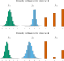

::: {.content-visible unless-format="revealjs"}

<center class='mb-3'>
<a class="h2" href="./slides.html" target="_blank">Open slides in new tab &rarr;</a>
</center>

:::


# Schedule {.smaller .small-title .crunch-title .crunch-callout data-name="Schedule"}

Today's Planned Schedule:

| | Start | End | Topic |
|:- |:- |:- |:- |
| **Lecture** | 6:30pm | 6:45pm | [Logistic Regression Recap &rarr;](#recap-logistic-regression) |
| | 6:45pm | 7:10pm | [From Discriminative to Generative Models &rarr;](#what-we-have-thus-far) |
| | 7:10pm | 8:00pm | [LDA, QDA, and Naive Bayes &rarr;](#building-an-anti-overfitting-toolkit) |
| **Break!** | 8:00pm | 8:10pm | |
| | 8:10pm | 8:30pm | [Quiz Review &rarr;](#quiz-review) |
| | 8:30pm | 9:00pm | Quiz! |

: {tbl-colwidths="[12,12,12,64]"}


::: {.hidden}

```{r}
#| label: r-source-globals
source("../dsan-globals/_globals.r")
set.seed(5300)
```

:::



# Recap: Logistic Regression {.smaller .crunch-ul .math-80 .title-09 data-stack-name="Recap"}

* What happens to the **probability** $\Pr(Y = 1 \mid X)$ when $X$ increases by **1 unit**?
* "Linear Probability Model" $\Pr(Y = 1 \mid X) = \beta_0 + \beta_1X$ fails, **but**, "fixing" it leads to

$$
\begin{align*}
&\log\left[ \frac{\Pr(Y = 1 \mid X)}{1 - \Pr(Y = 1 \mid X)} \right] = \beta_0 + \beta_1 X \\
\iff &\Pr(Y = 1 \mid X) = \frac{\exp[\beta_0 + \beta_1X]}{1 + \exp[\beta_0 + \beta_1X]} = \frac{1}{1 + \exp\left[ -(\beta_0 + \beta_1X) \right] }
\end{align*}
$$

> $\leadsto$ A 1-unit increase in $X$ is associated with a $\beta_1$ increase in the **log-odds** of $Y$

# From Discriminative to Generative Models {data-stack-name="Discriminative vs. Generative"}

## What Does Logistic Regression Model? {.smaller .crunch-title .title-11}

<iframe width="100%" height="582" frameborder="0"
  src="https://observablehq.com/embed/30d24d95fc115cb3?cells=viewof+outputVals%2CparamGrid%2Cchart"></iframe>

## Logistic Regression = *Discriminative* Model {.crunch-title .title-08}

* We choose $\beta_0$ and $\beta_1$ that best **discriminates between classes** $Y = 0$ and $Y = 1$
* In other words: We're modeling the **odds ratio** $\frac{\Pr(Y = 1 \mid x)}{\Pr(Y = 0 \mid x)}$ for given "vertical slices" $x$...

<hr>

* ...What if we instead modeled, for each **$Y$ value**, what the **distribution of the data $x$** looks like?

## LDA, QDA, Naive Bayes = *Generative* Models {.crunch-title .title-10 .smaller .crunch-iframe}

<iframe width="100%" height="607" frameborder="0"
  src="https://observablehq.com/embed/cec4dc24145339f7@844?cells=viewof+outputVals%2Clda_prediction_cell%2Clda_plot"></iframe>

# LDA $\leadsto$ QDA $\leadsto$ Naive Bayes {data-stack-name="Naive Bayes"}

## Let's Model Each *Features* by *Class* {.crunch-title .smaller}

{fig-align="center"}

## Which Class's Data "Looks More Like" $X$? {.crunch-title .smaller .title-10}

<iframe width="100%" height="643" frameborder="0"
  src="https://observablehq.com/embed/79f6590b8dcc3dd0?cells=viewof+outputVals%2Cnb_prediction_cell%2Cnb_plot"></iframe>

# Quiz Review {data-stack-name="Quiz Review"}

## The Logistic Link Function

# Quiz Time!

* Jeff hands out your (paper) quizzes now!
* You have 30 minutes (8:30 to 9pm)
* You got this 💪

## References

::: {#refs}
:::
