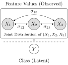
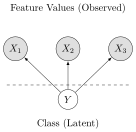
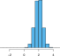
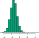
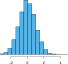

::: {.content-visible unless-format="revealjs"}

<center class='mb-3'>
<a class="h2" href="./slides.html" target="_blank">Open slides in new tab &rarr;</a>
</center>

:::


# Schedule {.smaller .small-title .crunch-title .crunch-callout data-name="Schedule"}

Today's Planned Schedule:

| | Start | End | Topic |
|:- |:- |:- |:- |
| **Lecture** | 6:30pm | 6:45pm | [Logistic Regression Recap &rarr;](#recap-logistic-regression) |
| | 6:45pm | 7:10pm | [From Discriminative to Generative Models &rarr;](#what-we-have-thus-far) |
| | 7:10pm | 8:00pm | [LDA, QDA, and Naive Bayes &rarr;](#building-an-anti-overfitting-toolkit) |
| **Break!** | 8:00pm | 8:10pm | |
| | 8:10pm | 8:30pm | [Quiz Review &rarr;](#quiz-review) |
| | 8:30pm | 9:00pm | Quiz! |

: {tbl-colwidths="[12,12,12,64]"}


::: {.hidden}

```{r}
#| label: r-source-globals
source("../dsan-globals/_globals.r")
set.seed(5300)
```

:::



# From Discriminative to Generative Models {data-stack-name="Discriminative vs. Generative"}

## Recap: Logistic Regression {.smaller .crunch-ul .math-80 .title-11}

* What happens to the **probability** $\Pr(Y = 1 \mid X)$ when $X$ increases by **1 unit**?
* "Linear Probability Model" $\Pr(Y = 1 \mid X) = \beta_0 + \beta_1X$ fails, **but**, "fixing" it leads to

$$
\begin{align*}
&\log\left[ \frac{\Pr(Y = 1 \mid X)}{1 - \Pr(Y = 1 \mid X)} \right] = \beta_0 + \beta_1 X \\
\iff &\Pr(Y = 1 \mid X) = \frac{\exp[\beta_0 + \beta_1X]}{1 + \exp[\beta_0 + \beta_1X]} = \frac{1}{1 + \exp\left[ -(\beta_0 + \beta_1X) \right] }
\end{align*}
$$

* A 1-unit increase in $X$ is associated with a $\beta_1$ increase in the **log-odds** $\log\mkern-3mu\left[ \frac{\Pr(Y=1)}{\Pr(Y=0)}\right]$
* $\Rightarrow$ effect of 1-unit increase in $X$ on $\Pr(Y = 1)$ **depends on $x$** (low, high, low)
* Then if we want to **classify $x \in \{0, 1\}$**, we apply a threshold $t \in [0,1]$:

$$
\widehat{y} = \begin{cases}
1 &\text{if }\Pr(Y = 1 \mid X = x) = \frac{e^{\beta_0 + \beta_1 x}}{1 + e^{\beta_0 + \beta_1 x}} > t \\
0 &\text{otherwise}
\end{cases}
$$

## What Does Logistic Regression Model? {.smaller .crunch-title .title-11}

<iframe width="100%" height="582" frameborder="0"
  src="https://observablehq.com/embed/30d24d95fc115cb3?cells=viewof+outputVals%2CparamGrid%2Cchart"></iframe>

## Logistic Regression = *Discriminative* Model {.crunch-title .title-08 .crunch-ul .crunch-li-8 .text-90}

* We choose $\beta_0$ and $\beta_1$ that best **discriminates between classes** $Y = 0$ and $Y = 1$
* In other words: We're modeling the **odds ratio** $\frac{\Pr(Y = 1 \mid x)}{\Pr(Y = 0 \mid x)}$ for given "vertical slices" $x$...

<hr>

* ...What if we instead modeled, for each **$Y$ value $k$**, what the **distribution of the data $[X \mid Y = k]$** looks like?
* Sometimes we can **do better**^[*(More normally-distributed, independent features $\Rightarrow$ more likely to "beat" Logistic Regression)*] by learning $\Pr(X \mid Y = k)$ for each $k$, then using Bayes rule to "flip" to $\Pr(Y = k \mid X)$ for prediction!

## LDA, QDA, Naive Bayes = *Generative* Models {.crunch-title .title-10 .smaller .crunch-iframe}

<iframe width="100%" height="607" frameborder="0"
  src="https://observablehq.com/embed/cec4dc24145339f7@844?cells=viewof+outputVals%2Clda_prediction_cell%2Clda_plot"></iframe>

## Where Did The Decision Boundary Come From? {.crunch-title .title-08 .text-80}

* May seem "obvious" for simple case (2 classes, 1 feature), but we need a **method** for **deriving** this boundary, for **any** number of classes/features!
* Boundary point $\frac{\mu_0 + \mu_1}{2}$ **emerges out of** LDA approach:
* <i class='bi bi-1-circle'></i> Compute **discriminant** functions $\delta_k(x)$ (defined in a few slides, but proportional to probability that $x$ in class $k$)
* <i class='bi bi-2-circle'></i> If $\delta_i(x) > \delta_j(x)$, $x$ more likely to be generated by class $i$ than class $j$
* <i class='bi bi-3-circle'></i> If $\delta_i(x) < \delta_j(x)$, $x$ more likely to be generated by class $j$ than class $i$
* <i class='bi bi-4-circle'></i> If $\delta_i(x) = \delta_j(x)$, $x$ equally likely to be generated by class $i$ and class $j$
* <i class='bi bi-5-circle'></i> Class $i$-$j$ **boundary** = set of $x$ values satisfying $\delta_i(x) = \delta_j(x)$
* On last slide: $\delta_0(x) = \delta_1(x)$ when $x = \frac{\mu_0 + \mu_1}{2}$

# Linear Discriminant Analysis (LDA) {data-stack-name="LDA"}

* *Not to be confused with the NLP model called "LDA"!*
* *In that case LDA = "Latent Dirichlet Allocation"*

## Bayes' Rule {.smaller .math-90 .crunch-ul}

* First things first, we generalize from $Y \in \{0, 1\}$ to $K$ possible classes (labels), since the notation for $K$ classes here is not much more complex than 2 classes!
* We label the pieces using ISLP's notation to make our lives easier:

$$
\underbrace{\Pr(Y = k \mid X = x)}_{p_k(x)} = \frac{
  \overbrace{\Pr(X = x \mid Y = k)}^{f_k(x)} \overbrace{\Pr(Y = k)}^{\pi_k}
}{
  \sum_{\ell = 1}^{K} \underbrace{\Pr(X = x \mid Y = \ell)}_{f_{\ell}(x)} \underbrace{\Pr(Y = \ell)}_{\pi_{\ell}}
} = \frac{f_k(x) \overbrace{\pi_k}^{\mathclap{\text{Prior}(k)}}}{\sum_{\ell = 1}^{K}f_{\ell}(x) \underbrace{\pi_\ell}_{\mathclap{\text{Prior}(\ell)}}}
$$

* So if we do have only two classes, $K = 2$ and $p_1(x) = \frac{f_1(x)\pi_1}{f_1(x)\pi_1 + f_0(x)\pi_0}$

* Priors can be estimated as $n_k / n$. The hard work is in modeling $f_k(x)$!
* Estimates of these two "pieces" for each $k$ $\leadsto$ classifier $\widehat{y}(x) = \argmax_k p_k(x)$

## The LDA Assumption (One Feature $x$) {.smaller .crunch-title .title-11 .math-90 .crunch-ul .crunch-li-8 .crunch-math-15}

* Within each class $k$, values of $x$ are **normally distributed**:
  
$$
(X \mid Y = k) \sim \mathcal{N}(\param{\mu_k}, \param{\sigma^2}) \iff f_k(x) = \frac{1}{\sqrt{2 \pi}\sigma}\exp\left[-\frac{1}{2}\left( \frac{x - \mu_k}{\sigma} \right)^2\right]
$$

* Plugging back into (notationally-simplified) classifier, we get

$$
\widehat{y}(x) = \argmax_{k}\left[ \frac{
  \pi_k \frac{1}{\sqrt{2 \pi}\sigma}\exp\left[-\frac{1}{2}\left( \frac{x - \mu_k}{\sigma} \right)^2\right]
}{
  \sum_{\ell = 1}^{K}\pi_{\ell} \frac{1}{\sqrt{2 \pi}\sigma}\exp\left[-\frac{1}{2}\left( \frac{x - \mu_\ell}{\sigma} \right)^2\right]
}\right],
$$

* Gross 🤮 BUT $\argmax_k p_k(x) = \argmax_k \log(p_k(x)) \leadsto$ "linear" discriminant $\delta_k(x)$:

$$
\widehat{y}(x) = \argmax_k[\delta_k(x)] = \argmax_{k}\left[ \overbrace{\frac{\mu_k}{\sigma^2}}^{\smash{m}} x ~ \overbrace{- \frac{\mu_k^2}{2\sigma^2} + \log(\pi_k)}^{\smash{b}} \right]
$$

## *Estimating* Decision Boundaries {.text-65 .crunch-title .crunch-ul .crunch-math .math-90}

* For two classes, can solve $\delta_0(x) = \delta_1(x)$ for $x$ to obtain $x = \frac{\mu_0 + \mu_1}{2}$
* ...But in real world we **don't have** $\mu_0$ or $\mu_1$ (population parameters)!
* Instead we **estimate** boundary from **data**: $x = \frac{\widehat{\mu}_0 + \widehat{\mu}_1}{2}$ $\Rightarrow$ Predict $1$ if $x > \frac{\widehat{\mu}_0 + \widehat{\mu}_1}{2}$, $0$ otherwise

{fig-align="center" width="80%"}

## Number of Parameters {.smaller .crunch-title}

* $K = 2$ is special case, since lots of things cancel out, but in general need to estimate:

| English | Notation | How Many? | Formula |
| - | - | - | - |
| Prior for class $k$ | $\widehat{\pi}_k$ | $K - 1$ | $\widehat{\pi}_k = n_k / n$ |
| Estimated mean for class $k$ | $\widehat{\mu}_k$ | $K$ | $\widehat{\mu}_k = \displaystyle \frac{1}{n_k}\sum_{\{i \mid y_i = k\}}x_i$ |
| Estimated (shared) variance | $\widehat{\sigma}^2$ | 1 | $\widehat{\sigma}^2 = \displaystyle \frac{1}{n - K}\sum_{k = 1}^{K}\sum_{i:y_i = k}(x_i - \widehat{\mu}_k)^2$ |
| | **Total:** | $2K$ | |

: {tbl-colwidths="[25,15,18,42]"}

* *(Keep in mind for fancier methods! This may blow up to be much larger than $n$)*

## LDA with Multiple Features (Here $p = 2$) {.smaller .crunch-title .title-11 .crunch-ul}

* Within each class $k$, values of $\mathbf{x}$ are **(multivariate) normally distributed**:
  
$$
\left( \begin{bmatrix}X_1 \\ X_2\end{bmatrix} \middle| ~ Y = k \right) \sim \mathbf{\mathcal{N}}_2(\param{\boldsymbol\mu_k}, \param{\mathbf{\Sigma}})
$$

* Increasing $p$ to 2 and $K$ to 3 means more parameters, but still **linear boundaries**. It turns out: shared variance ($\sigma^2$ or $\mathbf{\Sigma}$) will **always** produce linear boundaries 🤔

{fig-align="center"}

## Quadratic Class Boundaries {.smaller .crunch-title .title-12 .crunch-ul .math-90 .crunch-math}

* To achieve **non-linear** boundaries, estimate covariance matrix $\mathbf{\Sigma}_k$ for each class $k$:

$$
\left( \begin{bmatrix}X_1 \\ X_2\end{bmatrix} \middle| ~ Y = k \right) \sim \mathbf{\mathcal{N}}_2(\param{\boldsymbol\mu_k}, \param{\mathbf{\Sigma}_k})
$$

* Pros: Non-linear class boundaries! Cons: More parameters to estimate, does worse than LDA if data linearly-separable (or nearly linearly-separable). 
* Deciding factor: do you think DGP produces normal classes with same variance?

![ISLR Figure 4.9: Dashed [**purple**]{style='color: #b97dc3'} line is "true" boundary (Bayes decision boundary), dotted **black** line is LDA boundary, solid [**green**]{style='color: #009f86'} line is QDA boundary ](images/4_9.svg){fig-align="center"}

# So... What's the Catch? {data-stack-name="Naïve Bayes"}

* Why not just use QDA **all** the time?
* *(Hint: overfitting)*

## Explosion in \# Parameters {.text-65 .crunch-title .crunch-ul .table-va .title-11 .inline-90 .math-80 .crunch-quarto-figure .crunch-td .crunch-p .crunch-math .crunch-li .crunch-img}

* For more than a few features, **complexity** of fitting QDA model can become prohibitive: we have to estimate **bigger and bigger covariance matrix**

:::: {.columns}
::: {.column width="50%"}

<center>

**QDA**

</center>

* $p$ predictors $\Rightarrow \frac{p^2 + p}{2}$ unique covariance matrix entries

$$
\mathbf{\Sigma}^{\text{QDA}}_{p=2} = \begin{bmatrix}
\sigma_1^2 & \sigma_{12} \\
\sigma_{12} & \sigma_2^2
\end{bmatrix},
\mathbf{\Sigma}_{p=3} = \begin{bmatrix}
\sigma_1^2 & \sigma_{12} & \sigma_{13} \\
\sigma_{12} & \sigma_2^2 & \sigma_{23} \\
\sigma_{13} & \sigma_{23} & \sigma_3^2
\end{bmatrix}, \ldots
$$

* $K$ classes $\Rightarrow \frac{Kp^2 + Kp}{2}$ parameters to estimate

{fig-align="center" width="50%"}

:::
::: {.column width="50%"}

<center>

**Naïve Bayes Assumption**

</center>

* Independent features $\Rightarrow$ **diagonal** $\mathbf{\Sigma}$: no need to estimate relationships **between** features!

$$
\mathbf{\Sigma}^{\text{NB}}_{p=2} = \begin{bmatrix}
\sigma_1^2 & 0 \\
0 & \sigma_2^2
\end{bmatrix},
\mathbf{\Sigma}_{p=3} = \begin{bmatrix}
\sigma_1^2 & 0 & 0 \\
0 & \sigma_2^2 & 0 \\
0 & 0 & \sigma_3^2
\end{bmatrix}, \ldots
$$

* $\leadsto$ Reduction from $Kp^2$ to $Kp$ parameters!

{fig-align="center" width="50%"}

:::
::::

## ...Naïve Bayes to the Rescue! {.smaller .crunch-title .title-11}

* With Naïve Bayes assumption, can **visualize** feature distributions **by class**:

| | |
|:-:|:-:|:-:|:-:|
| | $\widehat{f}_k(X_1)$ | $\widehat{f}_k(X_2)$ | $\widehat{f}_k(X_3)$ |
| $k = 1$ | {fig-align="center" width="70%"} | {fig-align="center" width="70%"} | {fig-align="center" width="70%"} |
| $k = 2$ | {fig-align="center" width="70%"} | {fig-align="center" width="70%"} | {fig-align="center" width="70%"} |

: {tbl-colwidths="[10,30,30,30]"}

## Classifying New Points {.smaller .crunch-title .crunch-ul .table-va .title-11 .inline-90 .crunch-quarto-figure .crunch-td}

* For new feature values $x_{ij}$, compare **how likely** this value is under $k = 1$ vs. $k = 2$
* Example: $\mathbf{x} = (0.4, 1.5, 1)^{\top}$

| | |
|:-:|:-:|:-:|:-:|
| | $\widehat{f}_k(X_1)$ | $\widehat{f}_k(X_2)$ | $\widehat{f}_k(X_3)$ |
| $k = 1$ | {fig-align="center" width="50%"} | {fig-align="center" width="50%"} | {fig-align="center" width="50%"} |
| | $f_1(0.4) = 0.368$ | $f_1(1.5) = 0.484$ | $f_1(1) = 0.226$ |
| $k = 2$ | {fig-align="center" width="50%"} | {fig-align="center" width="50%"} | {fig-align="center" width="50%"} |
| | $f_2(0.4) = 0.030$ | $f_2(1.5) = 0.130$ | $f_2(1) = 0.616$ |

: {tbl-colwidths="[10,30,30,30]"}

## Which Class's Data "Looks More Like" $X$? {.crunch-title .smaller .title-10}

<iframe width="100%" height="643" frameborder="0"
  src="https://observablehq.com/embed/79f6590b8dcc3dd0?cells=viewof+outputVals%2Cnb_prediction_cell%2Cnb_plot"></iframe>

# Quiz Review {data-stack-name="Quiz Review"}

## Link Functions $\leftrightarrow$ Regression Models

* Basically... we're "hacking" linear regression to hande **any** type of data (within "exonential family" of distributions)
* (Board time!)

## References

::: {#refs}
:::
