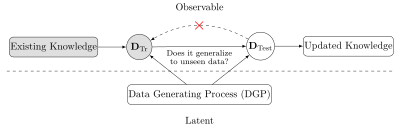

::: {.content-visible unless-format="revealjs"}

<center class='mb-3'>
<a class="h2" href="./slides.html" target="_blank">Open slides in new tab &rarr;</a>
</center>

:::

# Schedule {.smaller .small-title .crunch-title .crunch-callout data-name="Schedule"}

Today's Planned Schedule:

| | Start | End | Topic |
|:- |:- |:- |:- |
| **Lecture** | 6:30pm | 6:50pm | [Roadmap: Week 5 $\leadsto$ Week 6 &rarr;](#roadmap) |
| | 6:50pm | 7:20pm | [Non-Linear Data-Generating Processes &rarr;](#a-non-linear-data-generating-process-(dgp)) |
| | 7:20pm | 8:00pm | [Validation: Evaluating Non-Linear Models &rarr;](#cross-validation-evaluating-non-linear-models) |
| **Break!** | 7:50pm | 8:00pm | |
| | 8:00pm | 8:30pm | [Quiz Review &rarr;](#quiz-review) |
| | 8:30pm | 9:00pm | Quiz 5 |

: {tbl-colwidths="[12,12,12,64]"}

::: {.hidden}

```{r}
#| label: r-source-globals
source("../dsan-globals/_globals.r")
set.seed(5300)
```

:::



# Roadmap {.smaller .title-10 data-stack-name="Roadmap"}

* [Week 1] Oh no! When we go beyond linearity, we have to worry about **overfitting**!
    * $\implies$ New goal! Maximize **generalizability** rather than **accuracy**
    * $\implies$ Evaluate models on ***unseen* test data** rather than training data
* [Week 5] **Cross-Validation (CV)** as a tool for **Model Assessment**: For more complex, non-linear models, is there some way we can try to... "foresee" how well a trained model will **generalize?**
    * Answer: **Yes!** Cross-validation!
* [Week 6] **Regularization** as a tool for **Model Selection**: Now that we have a method (CV) for *imperfectly* measuring "generalizability", is there some way we can try to... **allow** models to optimize CV but **penalize** them for unnecessary complexity?
    * Answer: **Yes!** Regularization methods like LASSO and Elastic Net!

## [Reminder (W01)] New Goal: *Generalizability* {.smaller .crunch-title .crunch-callout .crunch-ul .title-11}

::: {.callout-tip .r-fit-text title="<i class='bi bi-info-circle'></i> The Goal of Statistical Learning" icon="false"}

Find...

* A function $\widehat{y} = f(x)$ ✅
* That best predicts $Y$ for given values of $X$ ✅
* For data that has not yet been observed! 😳❓

:::

# A Non-Linear Data-Generating Process (DGP) {data-stack-name="Non-Linear DGP"}

## Our Working DGP {.smaller .crunch-title .title-11 .math-75 .plotly-340 .crunch-math}

* Each country $i$ has a certain $x_i = \texttt{gdp\_per\_capita}_i$
* They spend some portion of it on **healthcare** each year, which translates (based on the country's healthcare system) into **health outcomes** $y_i$
* We *operationalize* these health outcomes as $y_i = \texttt{DALY}_i$: **[Disability Adjusted Life Years](https://ourworldindata.org/burden-of-disease)**, cross-nationally-standardized "lost years of minimally-healthy life"

:::: {.columns}
::: {.column width="60%"}

```{r}
#| label: cubic-dgp
#| fig-align: center
library(tidyverse) |> suppressPackageStartupMessages()
library(plotly) |> suppressPackageStartupMessages()
daly_df <- read_csv("assets/dalys_cleaned.csv")
daly_df <- daly_df |> mutate(
  gdp_pc_1k=gdp_pc_clean/1000
)
model_labels <- labs(
  x="GDP per capita ($1K PPP, 2021)",
  y="Log(DALYs/n)",
  title="Decrease in DALYs as GDP/n Increases"
)
daly_plot <- daly_df |> ggplot(aes(x=gdp_pc_1k, y=log_dalys_pc, label=name)) +
  geom_point() +
  # geom_smooth(method="loess", formula=y ~ x) +
  geom_smooth(method="lm", formula=y ~ poly(x,5), se=FALSE) +
  theme_dsan(base_size=14) +
  model_labels
ggplotly(daly_plot)
```

:::
::: {.column width="40%"}

$$
\begin{align*}
\leadsto Y = &10.58 - 0.2346 X + 0.01396 X^2 \\
&- 0.0004 X^3 + 0.000005 X^4 \\
&- 0.00000002 X^5 + \varepsilon
\end{align*}
$$

```{r}
#| label: fitted-cubic-curve
eval_fitted_poly <- function(x) {
  coefs <- c(
    10.58,  -0.2346, 0.01396,
    -0.0004156, 0.0000053527, -0.0000000244
  )
  x_terms <- c(x^0, x^1, x^2, x^3, x^4, x^5)
  dot_prod <- sum(coefs * x_terms)
  return(dot_prod)
}
N <- 500
x_vals <- runif(N, min=0, max=90)
y_vals <- sapply(X=x_vals, FUN=eval_fitted_poly)
sim_df <- tibble(gdpc=x_vals, ldalys=y_vals)
ggplot() +
  geom_line(data=sim_df, aes(x=gdpc, y=ldalys)) +
  geom_point(data=daly_df, aes(x=gdp_pc_1k, y=log_dalys_pc)) +
  theme_dsan() +
  model_labels
```

:::
::::

## The "True" Model {.smaller .crunch-title .crunch-ul .crunch-quarto-figure .crunch-li-5}

* From here onwards, we adopt this as our "true" model, for **pedagogical** purposes!
* Meaning: we use this model to get a sense for how...
  * CV can "foresee" **test error** $\leadsto$ confidence in CV
  * Regularization can **penalize** overly-complex models $\leadsto$ confidence in LASSO
* In the real world we **don't know the DGP!**
  * $\implies$ We **build our confidence** here, then **take off the training wheels** irl: use CV/Regularization in hopes they can help us "uncover" the **unknown DGP**

```{r}
#| label: dgp-realizations
#| fig-width: 15
#| fig-align: center
run_dgp <- function(world_label="Sim", N=60, x_max=90) {
  x_vals <- runif(N, min=0, max=x_max)
  y_raw <- sapply(X=x_vals, FUN=eval_fitted_poly)
  y_noise <- rnorm(N, mean=0, sd=0.8)
  y_vals <- y_raw + y_noise
  sim_df <- tibble(
    gdpc=x_vals,
    ldalys=y_vals,
    world=world_label
  )
  return(sim_df)
}
df1 <- run_dgp("World 1")
df2 <- run_dgp("World 2")
df3 <- run_dgp("World 3")
dgp_df <- bind_rows(df1, df2, df3)
dgp_df |> ggplot(aes(x=gdpc, y=ldalys)) +
  geom_point(aes(color=world)) +
  facet_wrap(vars(world)) +
  theme_dsan(base_size=22) +
  remove_legend() +
  model_labels +
  labs(title="Three Possible Realizations of our DGP")
```

## What We Have Thus Far {.smaller .crunch-title .title-10 .crunch-ul .crunch-img}

A **core model**, regression, that we can **build up** into p much anything we want!

| Class Topic | This Video |
| - | - |
| Linear regression | Pachelbel's *Canon in D* (1m26s-1m46s) |
| Logistic regression | Add swing: {width="100"} (1m46s) |



## Taking Off the Linearity Training Wheels {.smaller .title-11}

* Part 1: Wow, lots of new notes / rhythms we can use! (lines can **squiggle!**)
* But, **Part 2**: More chances to play **wrong notes** / **bad-sounding rhythms**

```{=html}
<style>
@font-face {
    font-family: Noodle;
    src: url('/assets/Kbnoodlemonster.ttf');
}
.workbench-jj {
  font-family: "Workbench", serif;
  /* font-optical-sizing: auto; */
  font-weight: 400;
  font-style: normal;
  font-size: 96pt !important;
}
.noodle-jj {
    font-family: "Noodle", serif;
    font-size: 96pt !important;
}
</style>
```

:::: {.columns}
::: {.column width="50%"}

::: {#fig-workbench}

<center>

[Linear Models]{.workbench-jj}

</center>

[Font Credit](https://fonts.google.com/specimen/Workbench)
:::

:::
::: {.column width="50%"}

::: {#fig-noodle}

<center>

[Linear Models]{.noodle-jj}

</center>

[Font Credit](http://keepinitkoolinkinderland.blogspot.com/p/fonts.html)
:::

:::
::::

# Building an Anti-Overfitting Toolkit {data-stack-name="Anti-Overfitting Toolkit"}

* Penalizing Complexity (Overview; More next week!)
* Cross-Validation
* Model Selection (Penalizing Complexity 2.0)

## Ok So, How Do We Avoid Overfitting? {.crunch-title .crunch-math .crunch-ul}

* The gist: penalize model **complexity**
* Original optimization:

  $$
  \theta^* = \underset{\theta}{\operatorname{argmin}} \mathcal{L}(y, \widehat{y})
  $$

* New optimization:

  $$
  \theta^* = \underset{\theta}{\operatorname{argmin}} \left[ \lambda \mathcal{L}(y, \widehat{y}) + (1-\lambda) \mathsf{Complexity}(\theta) \right]
  $$

* But how do we measure, and penalize, "complexity"?

## Regularization: Measuring and Penalizing Complexity {.smaller .title-11 .math-90}

-   In the case of polynomials, fairly simple complexity measure: *degree* of polynomial

$$
\mathsf{Complexity}(\widehat{y} = \beta_0 + \beta_1 x + \beta_2 x^2 + \beta_3 x^3) > \mathsf{Complexity}(\widehat{y} = \beta_0 + \beta_1 x)
$$

-   In general machine learning, however, we might not be working with polynomials
-   In neural networks, for example, we sometimes toss in millions of features and ask the algorithm to "just figure it out"
-   The gist, in the general case, is thus: try to "amplify" the most important features and shrink the rest, so that

$$
\mathsf{Complexity} \propto \frac{|\text{AmplifiedFeatures}|}{|\text{ShrunkFeatures}|}
$$

## LASSO and Elastic Net Regularization {.smaller .crunch-title .title-11 .math-90}

-   Many ways to translate this intuition into math!
-   In several fields, however (econ, biostatistics), LASSO[^4] [@tibshirani_regression_1996] is standard:

[^4]: **L**east **A**bsolute **S**hrinkage and **S**election **O**perator

$$
\beta^*_{LASSO} = {\underset{\beta}{\operatorname{argmin}}}\left\{{\frac {1}{N}}\left\|y-X\beta \right\|_{2}^{2}+\lambda \|\beta \|_{1}\right\}
$$

-   Why does this work to penalize complexity? What does the parameter $\lambda$ do?
-   Some known issues with LASSO fixed in extension of the same intuitions: **Elastic Net**

$$
\beta^*_{EN} = {\underset {\beta }{\operatorname {argmin} }}\left\{ \|y-X\beta \|^{2}_2+\lambda _{2}\|\beta \|^{2}+\lambda _{1}\|\beta \|_{1} \right\}
$$

-   Ensures a unique global minimum! Note that $\lambda_2 = 0, \lambda_1 = 1 \implies \beta^*_{LASSO} = \beta^*_{EN}$

## Training vs. Test Data

```{dot}
//| label: train-vs-test-diagram
//| fig-size: 3
graph grid
{
    graph [
        overlap=true
    ]
    nodesep=0.0
    ranksep=0.0
    rankdir="TB"
    node [
        style="filled",
        color=black,
        fillcolor=lightblue,
        shape=box
    ]

	// uncomment to hide the grid
	edge [style=invis]
	
	subgraph cluster_01 {
	    label="Training Set (80%)"
	N1[label="20%"] N2[label="20%"] N3[label="20%"] N4[label="20%"]
	}
	subgraph cluster_02 {
	    label="Test Set (20%)"
	N5[label="20%",fillcolor=orange]
	}
}
```

# Cross-Validation: Evaluating Non-Linear Models {.title-09 data-stack-name="Cross-Validation"}

Specifically: evaluating non-linear models **on how well they *generalize*!**

* Beyond the Train-Test Split
* Validation Set
* LOOCV
* $K$-Fold CV

## Training vs. Test Data

* We introduced this as a first step towards tackling the **scourge of overfitting!**

```{dot}
//| label: training-vs-test-diagram
//| echo: false
//| fig-height: 2
graph grid
{
    graph [
        overlap=true
    ]
    nodesep=0.0
    ranksep=0.0
    rankdir="TB"
    node [
        style="filled",
        color=black,
        fillcolor=lightblue,
        shape=box
    ]

	// uncomment to hide the grid
	edge [style=invis]
	
	subgraph cluster_01 {
	    label="Training Set (80%)"
	N1[label="20%"] N2[label="20%"] N3[label="20%"] N4[label="20%"]
	}
	subgraph cluster_02 {
	    label="Test Set (20%)"
	N5[label="20%",fillcolor=orange]
	}
}
```

* Training Set $\leadsto$ Training Error, Test Set $\leadsto$ Test Error
* So... what's the issue? Why do we need to complicate this picture?

## The Chilling Truth Behind Test Data 🫣 {.smaller .crunch-title .title-11}

* Science-wise, technically, once you use the **test set**, you should **stop working**
* Full gory details in fancy books (@hume_enquiry_1760 $\rightarrow$ @popper_logic_1934), but the essence is captured by visualizing scientific inference (and **statistical learning!**) like:

{fig-align="center"}

* So, what do we do? Use $\mathbf{D}_{\text{Tr}}$ along with knowledge of issues like **overfitting** to **estimate** test error!
* Fulfills our **goal**: find model which **best predicts $Y$ from $X$ for unobserved data**

## The Validation Set Approach {.crunch-title .crunch-ul .crunch-li-8 .crunch-quarto-figure}

* ⚠️ Remember: under our new goal, **"good" models** = models that **generalize well!**
* Optimizing over **test set** violates scientific inference axioms
* Instead, optimize over **training data** by "holding out" some portion of it... Enter the **Validation Set**:

```{dot}
//| label: cv-diagram
//| fig-height: 2.5
graph grid
{
    graph [
        overlap=true,
        scale=0.2
    ]
    nodesep=0.0
    ranksep=0.0
    rankdir="LR"
    scale=0.2
    node [
        style="filled",
        color=black,
        fillcolor=lightblue,
        shape=box
    ]

	// uncomment to hide the grid
	edge [style=invis]
	
	subgraph cluster_01 {
	    label="Training Set (80%)"
	    subgraph cluster_02 {
	        label="Training Fold (80%)"
	        A1[label="16%"] A2[label="16%"] A3[label="16%"] A4[label="16%"]
	    }
	    subgraph cluster_03 {
	        label="Validation Fold (20%)"
	        B1[label="16%",fillcolor=lightgreen]
	    }
	}
	subgraph cluster_04 {
	    label="Test Set (20%)"
	C1[label="20%",fillcolor=orange]
	}
	A1 -- A2 -- A3 -- A4 -- B1 -- C1;
}
```

## Evaluating *One* Model: Validation Set Approach {.text-90 .crunch-title .title-07 .inline-90}

* <i class='bi bi-1-circle'></i> Randomly pick 20% of $\mathbf{D}_{\text{train}}$ as **sub-training set** $\mathbf{D}_{\text{SubTr}}$
* <i class='bi bi-2-circle'></i> The other 80% becomes **validation set** $\mathbf{D}_{\text{Val}}$
* <i class='bi bi-3-circle'></i> Train model on $\mathbf{D}_{\text{SubTr}}$, then evaluate using $\mathbf{D}_{\text{Val}}$, to produce **validation error** $\boxed{\varepsilon_{\text{Val}} = \widehat{\text{Err}}_{\text{Test}}}$
* $\varepsilon_{\text{Val}}$ gives us an **estimate of the test error**
  * $\implies$ this is what we want to **optimize**, in place of **training error**, for our new goal 😎!

## How Does It Do for Our DGP? {.smaller .crunch-title}

* Recall that the "true" degree is **5**, but that you're not supposed to know that!

:::: {.columns}
::: {.column width="50%"}

```{r}
#| label: n200-delta-plot
#| fig-cap: "Here, validation error fails to capture 'true' model (likely culprits: low $N$, high noise...)"
library(boot)
set.seed(5300)
sim200_df <- run_dgp(
  world_label="N=200", N=200, x_max=100
)
sim1k_df <- run_dgp(
  world_label="N=1000", N=1000, x_max=100
)
compute_deltas <- function(df, min_deg=1, max_deg=12) {
  cv_deltas <- c()
  for (i in min_deg:max_deg) {
    cur_poly <- glm(ldalys ~ poly(gdpc, i), data=df)
    cur_poly_cv_result <- cv.glm(data=df, glmfit=cur_poly, K=5)
    cur_cv_adj <- cur_poly_cv_result$delta[1]
    cv_deltas <- c(cv_deltas, cur_cv_adj)
  }
  return(cv_deltas)
}
sim200_deltas <- compute_deltas(sim200_df)
sim200_delta_df <- tibble(degree=1:12, delta=sim200_deltas)
sim200_delta_df |> ggplot(aes(x=degree, y=delta)) +
  geom_line() +
  geom_point() +
  geom_vline(xintercept=5, linetype="dashed") +
  scale_x_continuous(
    breaks=seq(from=1,to=12,by=1)
  ) +
  theme_dsan(base_size=22) +
  labs(title="N = 200")
```

* Possible resolution: *[See coming slides!]*

:::
::: {.column width="50%"}

```{r}
#| label: n1k-delta-plot
#| fig-cap: Here, validation error fails to sharply distinguish $d \in \{5, 6, 7, 8\}$
sim1k_deltas <- compute_deltas(sim1k_df)
sim1k_delta_df <- tibble(degree=1:12, delta=sim1k_deltas)
sim1k_delta_df |> ggplot(aes(x=degree, y=delta)) +
  geom_line() +
  geom_point() +
  geom_vline(xintercept=5, linetype="dashed") +
  scale_x_continuous(
    breaks=seq(from=1,to=12,by=1)
  ) +
  theme_dsan(base_size=22) +
  labs(title="N = 1000")
```

* Possible resolution: *"one standard error rule"*

:::
::::

## Optimizing over *Many* Models {.crunch-title .title-09}

* <i class='bi bi-1-circle'></i> Let $\mathfrak{M} = (\mathcal{M}_1, \ldots, \mathcal{M}_D)$ be a set of $D$ different models
  * Ex: $\mathcal{M}_1$ could be a linear model, $\mathcal{M}_2$ a quadratic model, $\mathcal{M}_3$ a cubic model, and so on...
* <i class='bi bi-2-circle'></i> For each $\mathcal{M}_i \in \mathfrak{M}$ (and for given **training** data $\mathbf{D}_{\text{Tr}}$):
  * Use [Insert Validation Approach] to derive $\varepsilon_i$
* <i class='bi bi-3-circle'></i> Model $\mathcal{M}_i$ with **lowest $\varepsilon_i$ wins!**
* We are now **cooking with gas!** We can use CV to optimize over e.g. **HYPERPARAMETERS** 🤯 (that we had to just kind of... guess before)!

## Cooking with Even More Gas! {.crunch-title .crunch-ul .crunch-p}

*(加 even more 油!)*

* It turns out that, for the purposes of estimating test error (aka, estimating how well the fitted model will **generalize**), Validation Set Approach is the **worst** approach (still good, just, least good!)
* To see its limitations, consider: is there something special about the 20% of data we selected for the validation set?
* Answer: **No!** It was literally randomly selected!
* $\implies$ Any other 20% "chunk" (which we'll call a **fold** from now on) could work just as well

## 5-Fold Cross-Validation {.crunch-title .crunch-ul .crunch-quarto-figure}

* Secretly, by choosing a **20%** fold to be the validation set earlier, I was priming you for **5-fold** cross-validation!

](images/kfold.png){fig-align="center"}

## $K$-Fold Cross-Validation

* 5 was an arbitrary choice!
  * (Though, one with important and desirable statistical properties, which we'll get to ASAP)
* In general, $K$-Fold CV Estimator $\varepsilon_{(K)} = \widehat{\text{Err}}_{\text{Test}}$ given by

$$
\varepsilon_{(K)} = \frac{1}{K}\sum_{i=1}^{K}\varepsilon^{\text{Val}}_{i}
$$

## Leave-One-Out Cross-Validation (LOOCV) {.smaller .crunch-title .title-11}

* $K$-Fold CV with $K := N$
* Produces the maximum possible number of terms in the summation that leads to $\varepsilon_{(K)}$
  * i.e., $\varepsilon_{(N)}$ is an average over the maximum possible number of models
* So... does this mean it's the best choice?
* *Hint*: How "different" are any two models used in the sum?

$$
\begin{align*}
\varepsilon_{(N)} =~ & \text{Err}(\mathbf{D}_1 \mid \mathbf{D}_{2:100}) + \text{Err}(\mathbf{D}_2 \mid \mathbf{D}_1, \mathbf{D}_{3:100}) \\
&+ \text{Err}(\mathbf{D}_3 \mid \mathbf{D}_{1:2}, \mathbf{D}_{4:100}) + \cdots + \text{Err}(\mathbf{D}_{100} \mid \mathbf{D}_{1:99})
\end{align*}
$$

* The terms here are **highly correlated!**
* Fun math results around how $K = 5$ or $K = 10$ can best **strike a balance** between overly-correlated terms ($K = N$) and not averaging enough models ($K = 2$)!

# Quiz Review {data-stack-name="Quiz"}

## Linear Boundaries: 1D Case 🤷 {.smaller .crunch-title .title-11}

<iframe width="100%" height="591" frameborder="0"
  src="https://observablehq.com/embed/81c9e7a0fad0f93e@914?cells=viewof+outputVals%2Clda_prediction_cell%2CparamGrid%2Clogistic_plot"></iframe>

## Linear Boundaries: 2D Case 🙂‍↕️ {.smaller .crunch-title .title-11}

<iframe width="100%" height="766" frameborder="0"
  src="https://observablehq.com/embed/dc2f543e17998c63@1261?cells=viewof+outputVals%2Clda_prediction_cell%2CparamGrid%2Clogistic_plot%2CapplyStyle"></iframe>

## How Would We Figure This Out? {.smaller .crunch-title .crunch-math .title-11 .math-90}

* Remember that the boundary between classes is the **set of all points $(x_1,x_2)$ in the feature space** at which the model predicts $Y = 1$ and $Y = 0$ to be **equally likely**:

$$
\Pr(Y = 1 \mid X_1 = x_1, X_2 = x_2) = \Pr(Y = 0 \mid X_1 = x_1, X_2 = x_2)
$$

* Logistic Regression models the relationship between these two as a **log-odds ratio**:

$$
\ln\left[ \frac{\Pr(Y = 1 \mid X_1 = x_1, X_2 = x_2)}{\Pr(Y = 0 \mid X_1 = x_1, X_2 = x_2)} \right] = \beta_0 + \beta_1 x_1 + \beta_2 x_2
$$

* So, if the numerator and denominator are **equal**, we get

$$
\begin{align*}
&\ln[1] = \beta_0 + \beta_1x_1 + \beta_2x_2 \iff 0 = \beta_0 + \beta_1x_1 + \beta_2x_2 \\
\iff &\beta_2x_2 = -\beta_0 - \beta_1x_1 \iff x_2 = \boxed{-\frac{\beta_1}{\beta_2}} ~ x_1 - \boxed{\frac{\beta_0}{\beta_2}}
\end{align*}
$$

* ...This is the equation for a **line!** If we plot $x_1$ on the $x$-axis and $x_2$ on the $y$-axis, we get $y = mx + b$, where $m = -\frac{\beta_1}{\beta_2}$, $b = -\frac{\beta_0}{\beta_2}$

# Quiz 5

* Yalla!

## References

::: {#refs}
:::
