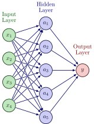
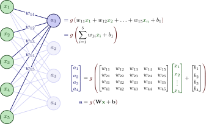
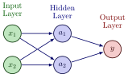
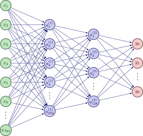
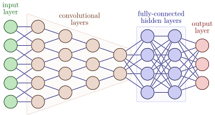
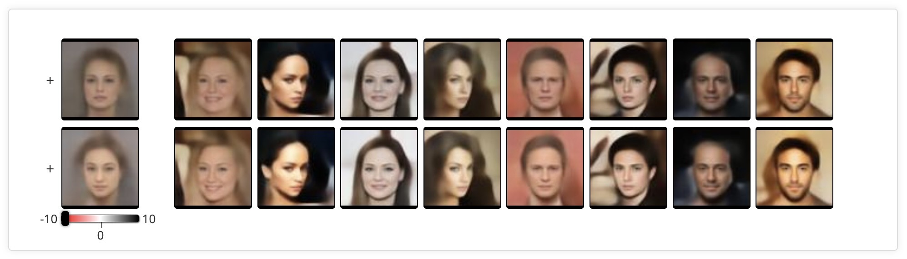
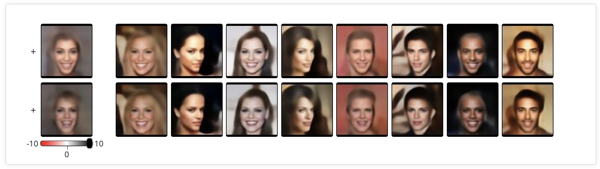
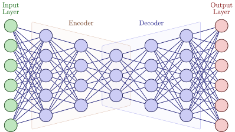
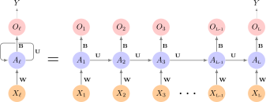

::: {.content-visible unless-format="revealjs"}

<center class='mb-3'>
<a class="h2" href="./slides.html" target="_blank">Open slides in new tab &rarr;</a>
</center>

:::

# Schedule {.smaller .small-title .crunch-title .crunch-callout data-stack-name="Schedule"}

Today's Planned Schedule:

| | Start | End | Topic |
|:- |:- |:- |:- |
| **Lecture** | 6:30pm | 7:00pm | [SMVs and the Kernel Trick &rarr;](#kern)
| **Lecture** | 7:00pm | 7:30pm | [Single Layer Neural Networks &rarr;](#learning-decision-boundaries) |
| | 7:30pm | 7:50pm | [Multilayer Neural Networks &rarr;](#multilayer-neural-networks) |
| **Break!** | 7:50pm | 8:00pm | |
| | 8:00pm | 9:00pm | [Fancier Neural Networks &rarr;](#fancier-neural-networks) |

: {tbl-colwidths="[12,12,12,64]"}

::: {.hidden}

```{r}
#| label: r-source-globals
source("../dsan-globals/_globals.r")
set.seed(5300)
```



:::


```{=html}
<style>
@font-face {
    font-family: Noodle;
    src: url('/assets/Kbnoodlemonster.ttf');
}
.noodle-jj {
    font-family: "Noodle", serif;
    font-size: 96pt !important;
}
.noodle-jj-smaller {
    font-family: "Noodle", serif;
    font-size: 54pt !important;
}
</style>
```

## Linear $\rightarrow$ [Linear]{.noodle-jj-smaller} {.crunch-title .inline-90 .crunch-ul .crunch-quarto-figure}

:::: {.columns}
::: {.column width="50%"}

* Old feature space: $\mathcal{S} = \{X_1, \ldots, X_J\}$
* New feature space: $\mathcal{S}^2 = \{X_1, X_1^2, \ldots, X_J, X_J^2\}$
* **Linear** boundary in $\mathcal{S}^2$ $\implies$ **Quadratic** boundary in $\mathcal{S}$
* Helpful example: Non-linearly separable in 1D $\leadsto$ Linearly separable in 2D

:::
::: {.column width="50%"}

1D Hyperplane = **point!** But no separating point here 😰

```{r}
#| label: plot-1d-nonsep
#| fig-height: 2.5
library(tidyverse) |> suppressPackageStartupMessages()
library(latex2exp) |> suppressPackageStartupMessages()
x_vals <- runif(50, min=-9, max=9)
data_df <- tibble(x=x_vals) |> mutate(
  label = factor(ifelse(abs(x) >= 6, 1, -1)),
  x2 = x^2
)
data_df |> ggplot(aes(x=x, y=0, color=label)) +
  geom_point(
    aes(color=label, shape=label), size=g_pointsize,
    stroke=6
  ) +
  geom_point(
    aes(fill=label), color='black', shape=21, size=6, stroke=0.75, alpha=0.333
  ) +
  # xlim(6,25) + ylim(2,22) +
  # coord_equal() +
  # 45 is minus sign, 95 is em-dash
  scale_shape_manual(values=c(95, 43)) +
  theme_dsan(base_size=28) +
  theme(
    axis.line.y = element_blank(),
    axis.text.y = element_blank(),
    axis.ticks.y = element_blank(),
    axis.title.y = element_blank()
  ) +
  xlim(-10, 10) +
  ylim(-0.1, 0.1) +
  labs(title="Non-Linearly-Separable Data") +
  theme(
    plot.margin = unit(c(0,0,0,20), "mm")
  )
```

```{r}
#| label: lift-1d-to-2d
#| crop: false
data_df |> ggplot(aes(x=x, y=x2, color=label)) +
  geom_point(
    aes(color=label, shape=label), size=g_pointsize,
    stroke=6
  ) +
  geom_point(
    aes(fill=label), color='black', shape=21, size=6, stroke=0.75, alpha=0.333
  ) +
  geom_hline(yintercept=36, linetype="dashed") +
  # xlim(6,25) + ylim(2,22) +
  # coord_equal() +
  # 45 is minus sign, 95 is em-dash
  scale_shape_manual(values=c(95, 43)) +
  theme_dsan(base_size=28) +
  xlim(-10, 10) +
  labs(
    title = TeX("...Linearly Separable in $R^2$!"),
    y = TeX("$x^2$")
  )
```

:::
::::

## And in 3D...

&nbsp;<br>

](images/kernel_trick.jpg){fig-align="center"}

## Taking This Idea and Running With It {.crunch-title .title-09}

* The goal: find a **transformation of the original space** that the (non-linearly-separable) data lives in, such that data ***is* linearly separable** in new space
* In theory, could just compute tons and tons of new features $\{X_1, X_1^2, X_1^3, \ldots, X_1X_2, X_1X_3, \ldots, X_1^2X_2, X_1^2X_3, \ldots\}$
* In practice this "blows up" the dimensionality of the feature space, making SVM slower and slower
* Weird trick (literally): turns out we only need **inner products** $\langle x_i, x_j \rangle$ between datapoints... **"Kernel Trick"**

## The Magic of Kernels {.smaller .crunch-title .title-12 .math-90}

Radial Basis Function (RBF) Kernel:

$$
K(x_i, x_{i'}) = \exp\left[ -\gamma \sum_{j=1}^{J} (x_{ij} - x_{i'j})^2 \right]
$$

:::: {.columns}
::: {.column width="50%"}

```{r}
#| label: linspike-svm
#| crop: false
library(kernlab) |> suppressPackageStartupMessages()
library(mlbench) |> suppressPackageStartupMessages()
if (!file.exists("assets/linspike_df.rds")) {
  set.seed(5300)
  N <- 120
  x1_vals <- runif(N, min=-5, max=5)
  x2_raw <- x1_vals
  x2_noise <- rnorm(N, mean=0, sd=1.25)
  x2_vals <- x2_raw + x2_noise
  linspike_df <- tibble(x1=x1_vals, x2=x2_vals) |>
    mutate(
      label = factor(ifelse(x1^2 + x2^2 <= 2.75, 1, -1))
    )
  linspike_svm <- ksvm(
    label ~ x1 + x2,
    data = linspike_df,
    kernel = "rbfdot",
    C = 500,
    prob.model = TRUE
  )
  # Grid over which to evaluate decision boundaries
  npts <- 500
  lsgrid <- expand.grid(
    x1 = seq(from = -5, 5, length = npts),
    x2 = seq(from = -5, 5, length = npts)
  )
  # Predicted probabilities (as a two-column matrix)
  prob_svm <- predict(
    linspike_svm,
    newdata = lsgrid,
    type = "probabilities"
  )
  # Add predicted class probabilities
  lsgrid2 <- lsgrid |>
    cbind("SVM" = prob_svm[, 1L]) |>
    tidyr::gather(Model, Prob, -x1, -x2)

  # Serialize for quicker rendering
  saveRDS(linspike_df, "assets/linspike_df.rds")
  saveRDS(lsgrid2, "assets/lsgrid2.rds")
} else {
  linspike_df <- readRDS("assets/linspike_df.rds")
  lsgrid2 <- readRDS("assets/lsgrid2.rds")
}
linspike_df <- linspike_df |> mutate(
  Label = label
)
linspike_df |> ggplot(aes(x = x1, y = x2)) +
  # geom_point(aes(shape = label, color = label), size = 3, alpha = 0.75) +
  geom_point(aes(shape = Label, color = Label), size = 3, stroke=4) +
  geom_point(aes(fill=Label), color='black', shape=21, size=4, stroke=0.75, alpha=0.4) +
  xlab(expression(X[1])) +
  ylab(expression(X[2])) +
  coord_fixed() +
  theme(legend.position = "none") +
  theme_dsan(base_size=28) +
  xlim(-5, 5) + ylim(-5, 5) +
  stat_contour(
    data = lsgrid2,
    aes(x = x1, y = x2, z = Prob),
    breaks = 0.5,
    color = "black"
  ) +
  scale_shape_manual(values=c(95, 43))
```

:::
::: {.column width="50%"}

```{r}
#| label: spiral-svm
#| crop: false
#| fig-cap: Based on code from @boehmke2019handson, Ch 14
if (!file.exists("assets/spiral_df.rds")) {
  spiral_df <- as.data.frame(
    mlbench.spirals(300, cycles = 2, sd = 0.09)
  )
  names(spiral_df) <- c("x1", "x2", "label")

  # Fit SVM using a RBF kernel
  spirals_svm <- ksvm(
    label ~ x1 + x2,
    data = spiral_df,
    kernel = "rbfdot",
    C = 500,
    prob.model = TRUE
  )

  # Grid over which to evaluate decision boundaries
  npts <- 500
  xgrid <- expand.grid(
    x1 = seq(from = -2, 2, length = npts),
    x2 = seq(from = -2, 2, length = npts)
  )

  # Predicted probabilities (as a two-column matrix)
  prob_svm <- predict(
    spirals_svm,
    newdata = xgrid,
    type = "probabilities"
  )

  # Add predicted class probabilities
  xgrid2 <- xgrid |>
    cbind("SVM" = prob_svm[, 1L]) |>
    tidyr::gather(Model, Prob, -x1, -x2)

  # Serialize for quicker rendering
  saveRDS(spiral_df, "assets/spiral_df.rds")
  saveRDS(xgrid2, "assets/xgrid2.rds")
} else {
  spiral_df <- readRDS("assets/spiral_df.rds")
  xgrid2 <- readRDS("assets/xgrid2.rds")
}
# And plot
spiral_df <- spiral_df |> mutate(
  Label = factor(ifelse(label == 2, 1, -1))
)
spiral_df |> ggplot(aes(x = x1, y = x2)) +
  geom_point(aes(shape = Label, color = Label), size = 3, stroke=4) +
  geom_point(aes(fill=Label), color='black', shape=21, size=4, stroke=0.75, alpha=0.4) +
  xlab(expression(X[1])) +
  ylab(expression(X[2])) +
  xlim(-2, 2) +
  ylim(-2, 2) +
  coord_fixed() +
  theme(legend.position = "none") +
  theme_dsan(base_size=28) +
  stat_contour(
    data = xgrid2,
    aes(x = x1, y = x2, z = Prob),
    breaks = 0.5,
    color = "black"
  ) +
  scale_shape_manual("Label", values=c(95, 43))
```

:::
::::

## How Is This Possible? {.smaller .crunch-math .crunch-title .title-12}

* SVM prediction for an observation $\mathbf{x}$ can be rewritten as

$$
f(\mathbf{x}) = \beta_0 + \sum_{i=1}^{n} \alpha_i \langle \mathbf{x}, \mathbf{x}_i \rangle
$$

* Rather than one parameter $\beta_j$ per *feature*, we have one parameter $\alpha_i$ per *observation*
* At first this seems worse, since usually $n > p$... But we're saved by **support vectors!**
* Since the margin itself is only a function of the support vectors (not *every* vector---remember that margin $\neq$ average distance!), $\alpha_i > 0$ only when $\mathbf{x}_i$ a support vector! 
* So the equation becomes $f(\mathbf{x}) = \beta_0 + \sum_{i \in \mathcal{SV}} \alpha_i \langle \mathbf{x}, \mathbf{x}_i \rangle$, just one step left...
* **Kernel** $K$ = **similarity function** (generalization of inner product!)

$$
f(\mathbf{x}) = \beta_0 + \sum_{i \in \mathcal{SV}} \alpha_i K(\mathbf{x}, \mathbf{x}_i)
$$

## Inner Products are Already Similarities! {.smaller .crunch-title .title-11}

* When linearly separable, this is exactly the property we use (by computing inner product of new vector $\mathbf{x}$ with support vectors $\mathbf{x}_i$) to classify!

](images/dot_product_crop.svg){fig-align="center"}

* Why restrict ourselves to *this* similarity function? Choosing $K$ **converts the problem**:
  * From finding **transformation of *features*** allowing linear separability
  * To finding **similarity function for *observations*** allowing linear separability

## Kernel Trick as Two-Sided Swiss Army Knife {.smaller .title-11 .crunch-title .crunch-math}

* <i class='bi bi-1-circle'></i> If we *have* a linearly-separating transformation (like $f(x) = x^2$), can "encode" as kernel, saving computation
* Example: Transformation of features $f(x) = x^2$ equivalent to **quadratic kernel:**

  $$
  K(x_i, x_{i'}) = (1 + \sum_{j = 1}^{p}x_{ij}x_{i'j})^2
  $$

* <i class='bi bi-2-circle'></i> If we *don't* have a transformation (and having trouble figuring it out), can **change the problem** into one of finding a "good" **similarity function**
* Example: Look again at RBF Kernel:

  $$
  K(x_i, x_{i'}) = \exp\left[ -\gamma \sum_{j=1}^{J} (x_{ij} - x_{i'j})^2 \right]
  $$

* It turns out: **no** finite collection of transformed features is equivalent to this kernel! (Roughly: can keep adding transformed features to asymptotically approach it---space of SVMs w/kernel thus $>$ space of SVMs w/transformed features)

# Single-Layer Neural Networks {.smaller .title-12 data-stack-name="Single-Layer NNs"}

*(We made it! [Statistical]{style='text-decoration: line-through;'} **Neural** learning*

{fig-align="center"}

## Diagram $\leftrightarrow$ Math {.crunch-title .cols-va .crunch-math .crunch-quarto-figure .math-90 .inline-90 .crunch-ul .crunch-li-8 .title-09}

:::: {.columns}
::: {.column width="66%"}

* $p = 4$ features in [**Input Layer**]{.cb-in}
* $K = 5$ [**Hidden Units**]{.cb-hidden}
* [**Output Layer**]{.cb-out}: Regression on **activations** $a_k$ ([Hidden Unit]{.cb-hidden} outputs)

$$
\begin{align*}
{\color{#976464} y} &= { \color{#976464} \beta_0 } + {\color{#666693} \sum_{k=1}^{5} } {\color{#976464} \beta_k } { \color{#666693} \overbrace{\boxed{a_k} }^{\mathclap{k^\text{th}\text{ activation}}} } \\
{\color{#976464} y} &= { \color{#976464} \beta_0 } + {\color{#666693} \sum_{k=1}^{5} } {\color{#976464} \beta_k } { \color{#666693} \underbrace{ g \mkern-4mu \left( w_{k0} + {\color{#679d67} \sum_{j=1}^{4} } w_{kj} {\color{#679d67} x_j} \right) }_{k^\text{th}\text{ activation}}}
\end{align*}
$$

:::
::: {.column width="34%"}

{fig-align="center" width="100%"}

:::
::::

## Matrix Form (Only if Sanity-Helping) {.smaller .crunch-title .title-12}

{fig-align="center"}

## Example

* Rather than pondering over what that diagram can/can't do, consider two "true" DGPs:

$$
\begin{align*}
Y &= {\color{#e69f00} X_1 X_2 } \\
Y &= {\color{#56b4e9} X_1^2 + X_2^2 } \\
Y &= {\color{#009E73} X_1 \underset{\mathclap{\small \text{XOR}}}{\oplus} X_2}
\end{align*}
$$

* How exactly is a neural net able to learn these relationships?

## Sum of Squares {.smaller .crunch-title .crunch-math .cols-va .crunch-quarto-figure .crunch-ul}

:::: {.columns}
::: {.column width="45%"}

* Can we learn $y = {\color{#56b4e9} x_1^2 + x_2^2 }$?
* Let's use $g(x) = x^2$.
* Let $\mathbf{w}_1 = (0, 1, 0)$, $\mathbf{w}_2 = (0, 0, 1)$.
* Our two activations are:

:::
::: {.column width="55%"}

{fig-align="center" width="66.6%"}

:::
::::

$$
\begin{align*}
{\color{#666693} a_1 } &= g(0 + (1)(x_1) + (0)(x_2)) = x_1^2 \\
{\color{#666693} a_2 } &= g(0 + (0)(x_1) + (1)(x_2)) = x_2^2
\end{align*}
$$

* So, if $\boldsymbol\beta = (0, 1, 1)$, then

$$
{\color{#976464} y } = 0 + (1)(x_1^2) + (1)(x_2^2) = {\color{#56b4e9} x_1^2 + x_2^2} \; ✅
$$

## Interaction Term {.smaller .crunch-title .crunch-math .cols-va .crunch-quarto-figure .crunch-ul}

:::: {.columns}
::: {.column width="45%"}

* Can we learn $Y = {\color{#e69f00} x_1x_2}$?
* Let's use $g(x) = x^2$ again.
* Let $\mathbf{w}_1 = (0, 1, 1)$, $\mathbf{w}_2 = (0, 1, -1)$.
* Our two activations are:

:::
::: {.column width="55%"}

{fig-align="center" width="66.6%"}

:::
::::

$$
\begin{align*}
{\color{#666693} a_1 } &= g(0 + (1)(x_1) + (1)(x_2)) = (x_1 + x_2)^2 = x_1^2 + x_2^2 +2x_1x_2 \\
{\color{#666693} a_2 } &= g(0 + (1)(x_1) + (-1)(x_2)) = (x_1 - x_2)^2 = x_1^2 + x_2^2 - 2x_1x_2
\end{align*}
$$

* So, if we let $\boldsymbol\beta = \left( 0, \frac{1}{4}, -\frac{1}{4} \right)$, then

$$
{\color{#976464} y } = 0 + \left(\frac{1}{4}\right)(x_1^2 + x_2^2 + 2x_1x_2) + \left(-\frac{1}{4}\right)(x_1^2 + x_2^2 - 2x_1x_2) = {\color{#e69f00} x_1x_2} \; ✅
$$


## The XOR Problem {.smaller .crunch-title .crunch-math .cols-va .crunch-quarto-figure .crunch-ul}

:::: {.columns}
::: {.column width="45%"}

* Can we learn $Y = {\color{#009E73} x_1 \underset{\mathclap{\small \text{XOR}}}{\oplus} x_2}$?
* Let's use $g(x) = x^2$ once more.
* Let $\mathbf{w}_1 = (0, 1, 1)$, $\mathbf{w}_2 = (0, 1, -1)$.
* Our two activations are:

:::
::: {.column width="55%"}

{fig-align="center" width="66.6%"}

:::
::::

$$
\begin{align*}
{\color{#666693} a_1 } &= g(0 + (1)(x_1) + (1)(x_2)) = (x_1 + x_2)^2 = x_1^2 + x_2^2 +2x_1x_2 \\
{\color{#666693} a_2 } &= g(0 + (1)(x_1) + (-1)(x_2)) = (x_1 - x_2)^2 = x_1^2 + x_2^2 - 2x_1x_2
\end{align*}
$$

* So, if we let $\boldsymbol\beta = (0, 0, 1)$, then

$$
\begin{align*}
{\color{#976464} y }(0,0) &= 0 + (0)(0^2 + 0^2 + 2(0)(0)) + (1)(0^2 + 0^2 - 2(0)(0)) = {\color{#009e73} 0} \; ✅ \\
{\color{#976464} y }(0,1) &= 0 + (0)(0^2 + 1^2 + 2(0)(1)) + (1)(0^2 + 1^2 - 2(0)(1)) = {\color{#009e73} 1} \; ✅ \\
{\color{#976464} y }(1,0) &= 0 + (0)(1^2 + 0^2 + 2(1)(0)) + (1)(1^2 + 0^2 - 2(1)(0)) = {\color{#009e73} 1} \; ✅ \\
{\color{#976464} y }(1,1) &= 0 + (0)(1^2 + 1^2 + 2(1)(1)) + (1)(1^2 + 1^2 - 2(1)(1)) = {\color{#009e73} 0} \; ✅
\end{align*}
$$

## But How? {.smaller .crunch-title .crunch-quarto-figure .crunch-img}

* **Output Layer** is just linear regression on **activations** (Hidden Layer outputs)
* We saw in Week 7 how good **basis function** allows regression to learn **any** function
* Neural Networks: **GOAT non-linear basis function learners!**

:::: {.columns}
::: {.column width="33%"}

```{r}
#| label: fig-xor-problem
#| crop: false
#| fig-height: 8
#| fig-cap: The DGP $Y = x_1 \oplus x_2$ produces points in $[0,1]^2$ which are not linearly separable
library(tidyverse) |> suppressPackageStartupMessages()
library(latex2exp) |> suppressPackageStartupMessages()
xor_df <- tribble(
    ~x1, ~x2, ~label,
    0, 0, 0,
    0, 1, 1,
    1, 0, 1,
    1, 1, 0
) |>
mutate(
    h1 = (x1 - x2)^2,
    label = factor(label)
)
xor_df |> ggplot(aes(x=x1, y=x2, label=label)) +
  geom_point(
    aes(color=label, shape=label),
    size=g_pointsize * 2,
    stroke=6
  ) +
  geom_point(aes(fill=label), color='black', shape=21, size=g_pointsize * 2.5, stroke=0.75, alpha=0.4) +
  scale_x_continuous(breaks=c(0, 1)) +
  scale_y_continuous(breaks=c(0, 1)) +
  expand_limits(y=c(-0.1,1.1)) +
  # 45 is minus sign, 95 is em-dash
  scale_shape_manual(values=c(95, 43)) +
  theme_dsan(base_size=32) +
  remove_legend_title() +
  labs(
    x=TeX("$x_1$"),
    y=TeX("$x_2$"),
    title="XOR Problem: Original Features"
  )
```

:::
::: {.column width="33%"}

```{r}
#| label: fig-xor-problem-tr
#| crop: false
#| fig-height: 8
#| fig-cap: Learned bases $h_1 = (x_1 - x_2)^2$ and $h_2 = (x_1 + x_2)^2$ enable **separating hyperplane** $h_1 = 0.5$
library(tidyverse)
xor_df <- tribble(
    ~x1, ~x2, ~label,
    0, 0, 0,
    0, 1, 1,
    1, 0, 1,
    1, 1, 0
) |>
mutate(
    h1 = (x1 - x2)^2,
    h2 = (x1 + x2)^2,
    h2 = ifelse(h1 > 0.5 & x2==0, h2 + 0.5, h2),
    label = factor(label)
)
xor_df |> ggplot(aes(x=h1, y=h2, label=label)) +
  geom_vline(xintercept=0.5, linetype="dashed", linewidth=1) +
  # Negative space
  geom_rect(xmin=-Inf, xmax=0.5, ymin=-Inf, ymax=Inf, fill=cb_palette[1], alpha=0.15) +
  # Positive space
  geom_rect(xmin=0.5, xmax=Inf, ymin=-Inf, ymax=Inf, fill=cb_palette[2], alpha=0.15) +
  geom_point(
    aes(color=label, shape=label),
    size=g_pointsize * 2,
    stroke=6
  ) +
  geom_point(aes(fill=label), color='black', shape=21, size=g_pointsize*2.5, stroke=0.75, alpha=0.4) +
  expand_limits(y=c(-0.2,4.2)) +
  # 45 is minus sign, 95 is em-dash
  scale_shape_manual(values=c(95, 43)) +
  theme_dsan(base_size=32) +
  remove_legend_title() +
  labs(
    title="NN-Learned Feature Space",
    x=TeX("$h_1(x_1, x_2)$"),
    y=TeX("$h_2(x_1, x_2)$")
  )
```

:::
::: {.column width="33%"}

```{r}
#| label: fig-xor-inverse
#| fig-height: 8
#| fig-cap: Here, the blue area represents points where $h_1 = (x_1 - x_2)^2 > 0.5$
library(tidyverse)
x1_vals <- seq(from=0, to=1, by=0.0075)
x2_vals <- seq(from=0, to=1, by=0.0075)
grid_df <- expand.grid(x1=x1_vals, x2=x2_vals) |>
  as_tibble() |>
  mutate(
    label=factor(as.numeric((x1-x2)^2 > 0.5))
  )
ggplot() +
  geom_point(
    data=grid_df,
    aes(x=x1, y=x2, color=label),
    alpha=0.4
  ) +
  geom_point(
    data=xor_df,
    aes(x=x1, y=x2, color=label, shape=label),
    size=g_pointsize * 2,
    stroke=6
  ) +
  geom_point(
    data=xor_df,
    aes(x=x1, y=x2, fill=label),
    color='black', shape=21, size=g_pointsize*2.5, stroke=0.75, alpha=0.4
  ) +
  geom_abline(slope=1, intercept=0.7, linetype="dashed", linewidth=1) +
  geom_abline(slope=1, intercept=-0.7, linetype="dashed", linewidth=1) +
  scale_shape_manual(values=c(95, 43)) +
  theme_dsan(base_size=32) +
  remove_legend_title() +
  labs(
    title="XOR Problem: Inverted NN Features",
    x=TeX("$X_1$"), y=TeX("$X_2$")
  )
```

:::
::::

# Multilayer Neural Networks {.smaller .crunch-title .title-12 data-stack-name="Multilayer NNs"}

{fig-align="center"}

## Input Representation {.smaller .crunch-title .cols-va}

:::: {.columns}
::: {.column width="50%"}

, 3Blue1Brown](images/mnist_repr.jpg){fig-align="center" width="100%"}

:::
::: {.column width="50%"}

{fig-align="center" width="100%"}

:::
::::

## But Wait... Ten Outputs? {.smaller .crunch-title .crunch-ul .cols-va}

:::: {.columns}
::: {.column width="50%"}

{fig-align="center" width="100%"}

:::
::: {.column width="50%"}

* The (magical) **softmax** function!

$$
z_d = \Pr(Y = d \mid X) = \frac{e^{y_d}}{\sum_{i=0}^{9}e^{y_i}}
$$

* Ensures that each $Z_d$ is a **probability!**

$$
\begin{align}
0 \leq z_d &\leq 1 \; \; \forall ~ d \in \{0,\ldots,9\} \\
\sum_{d=0}^{9}z_d &= 1
\end{align}
$$

:::
::::

## Visualizing Softmax Results

](images/mnist.jpg)

# Fancier Neural Networks {data-stack-name="Fancier NNs"}

* Convolutional Neural Networks (CNNs)
* Recurrent Neural Networks (RNNs)

## CNNs {.crunch-title .crunch-ul}

* Key point: Convolutional layers are **not** fully connected!
* Each layer "pools" info from two units in previous layer

{fig-align="center"}

## Decoding the Thought Vector {.crunch-title .title-11 .crunch-ul .smaller .crunch-quarto-figure .crunch-img}

* Hidden layers closer to input layer detect low-level "fine-grained" features
* Hidden layers closer to output layer detect high-level "coarse-grained" features

{fig-align="center" width="70%"}

{fig-align="center" width="70%"}

<center>

[**Decoding the Thought Vector**](https://gabgoh.github.io/ThoughtVectors/)

</center>

## Variational Autoencoders

{fig-align="center"}

## RNNs {.smaller}

*...More next week, tbh*

{fig-align="center"}

## Ok But How Do We *Learn* The Weights? {.smaller .title-11}

 (3Blue1Brown Again!)](images/backprop.jpg){fig-align="center"}

*(Full NN playlist [here](https://www.youtube.com/playlist?list=PLZHQObOWTQDNU6R1_67000Dx_ZCJB-3pi))*

## References

::: {#refs}
:::
