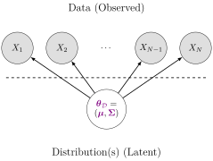
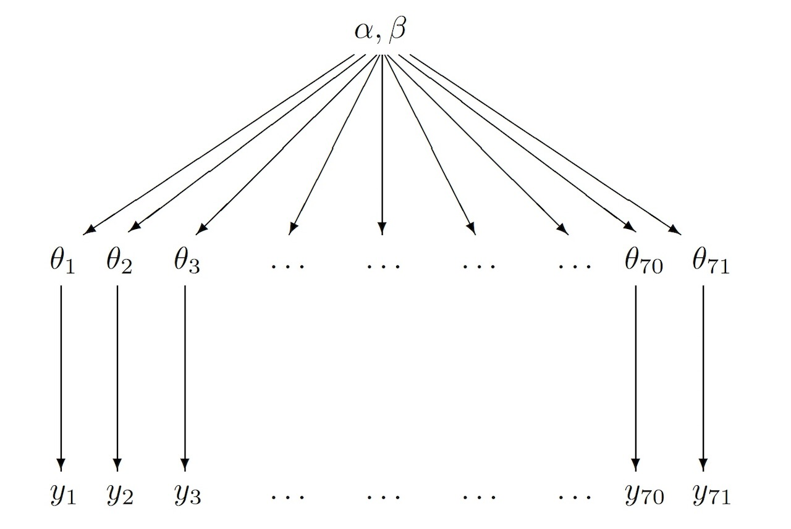

::: {.content-visible unless-format="revealjs"}

<center class='mb-3'>
<a class="h2" href="./slides.html" target="_blank">Open slides in new tab &rarr;</a>
</center>

:::

# Schedule {.smaller .small-title .crunch-title .crunch-callout data-stack-name="Schedule"}

Today's Planned Schedule:

| | Start | End | Topic |
|:- |:- |:- |:- |
| **Lecture** | 6:30pm | 7:30pm | [Past Final Projects!](../past-projects.qmd) |
| | 7:30pm | 8:00pm | [Bayesian Linear Regression &rarr;](#bayesian-linear-regression) |
| **Break!** | 8:00pm | 8:10pm | |
| | 8:10pm | 9:00pm | [Adventures in Covariance &rarr;](#adventures-in-covariance) |

: {tbl-colwidths="[12,12,12,64]"}

::: {.hidden}

```{r}
#| label: r-source-globals
source("../dsan-globals/_globals.r")
set.seed(5300)
```

:::



# *Bayesian* Linear Regression {data-stack-name="Bayesian Regression"}

## Data-Generating Processes (DGPs) {.title-11 .crunch-title .crunch-ul .crunch-quarto-figure .crunch-quarto-layout-panel .crunch-li-5}

:::: {layout="[50,50]" layout-align="center" layout-valign="center"}
::: {#dgps-5100}

* You saw this in DSAN 5100!
* «$X_1, \ldots, X_n$ drawn i.i.d. Normal, mean $\mu$ variance $\sigma^2$» characterizes **DGP of $(X_1, \ldots, X_n)$**

:::

{fig-align="center"}

::::

## And Regression?

)](images/linear_regression.png){fig-align="center" width="220"}

## Learning Parameters *Sequentially*

{fig-align="center"}

# Adventures in Covariance {data-stack-name="Covariance Deep Dive"}

## Why Should We Care About Covariance?

{fig-align="center"}

## References

::: {#refs}
:::
