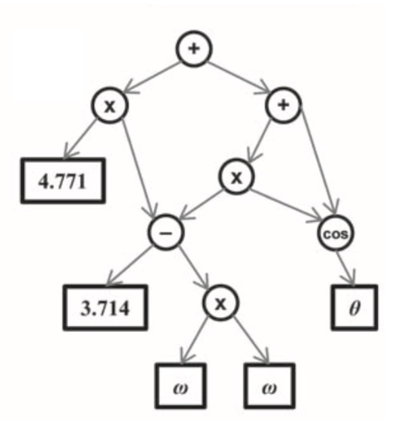
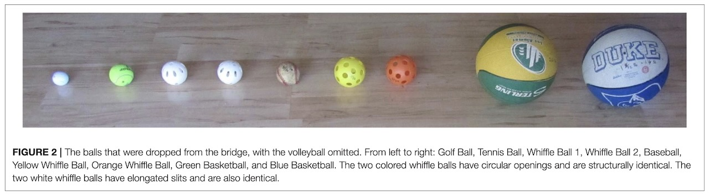
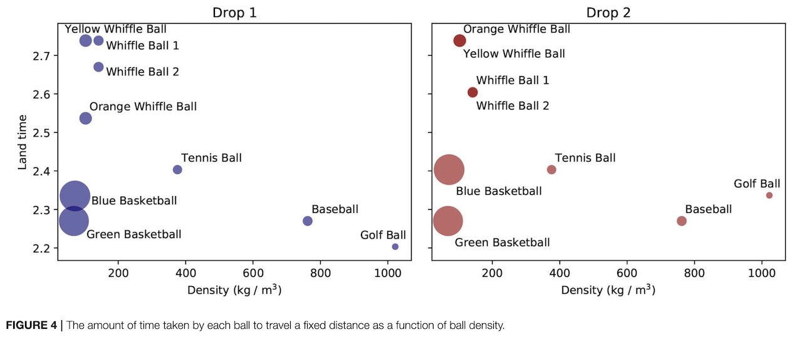
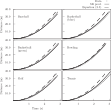

::: {.content-visible unless-format="revealjs"}

<center class='mb-3'>
<a class="h2" href="./slides.html" target="_blank">Open slides in new tab &rarr;</a>
</center>

:::

# Schedule {.smaller .small-title .crunch-title .crunch-callout data-stack-name="Schedule"}

Today's Planned Schedule:

| | Start | End | Topic |
|:- |:- |:- |:- |
| **Lecture** | 6:30pm | 7:00pm | [Symbolic Regression: What Can a Machine Learn? &rarr;](#learning-decision-boundaries) |
| | 7:00pm | 7:20pm | [Comparing Between Groups &rarr;](#comparing-survival-curves) | 
| | 7:20pm | 8:00pm | [Regression (Cox Proportional Hazard Model) &rarr;](#regression-with-survival-response) |
| **Break!** | 8:00pm | 8:10pm | |
| | 8:10pm | 9:00pm | [Quiz 3 &rarr;](#quiz-time) |

: {tbl-colwidths="[12,12,12,64]"}

::: {.hidden}

```{r}
#| label: r-source-globals
source("../dsan-globals/_globals.r")
set.seed(5300)
```

:::



# Symbolic Regression: What Can a Machine Learn? {.smaller .title-12 data-stack-name="Symbolic Regression"}

Thus far, we have either...

* Learned $X \rightarrow Y$ relationship by setting up a **parametric equation** like $Y = \beta_0 + \beta_1X_1 + \cdots + \beta_jX_j$, then figured out how to **learn the parameters** $\beta_j$,
* Tried to find a **non-parametric** way to learn $X \rightarrow Y$ relationship ($K$-Nearest Neighbors! **"Memory-based"**), or
* Asked the computer to find patterns in $X$ (no $Y$): **Unsupervised** learning
* There are other (more... "thinking outside the box") approaches! Let's look at one (evolutionary computation), then move to thinking more generally about **what a machine can learn**

## Symbolic Regression: "Evolving" Equations {.crunch-title .title-09 .text-90}

* Think of the relationship $X \rightarrow Y$ as a mathematical expression with a "DNA" (bitstring) encoding...
* The DNA "nucleotides" (substrings) can code foar:
  * Operations: $+$, $-$, $\times$, $\div$, $\sqrt{}$, $\exp(\cdot)$, $\sin(\cdot)$, $\arcsin(\cdot)$, etc.
  * Variables: $x_1, x_2, \ldots, x_n$
  * Constants: $1$, $−1$, $0$, $\pi$, $e$, $1.2$
* Examples: $y = x_1 + 1$, $y = x_2$, $y = x_1 + \sin(x_2)$, $y = \sin(x_1) + x_2 − 1$, $y = \sqrt{\sin(x_1) + 1}$

::: {.aside}

Slides derived from [Andrew Jiang's very helpful slides](https://tamids.tamu.edu/wp-content/uploads/2021/11/Slides-Andrew-Jiang.pdf)!

:::

## Evolution of a Computation Graph

{fig-align="center"}

## Ex 1: Learning a *Known* Equation (Newton) {.smaller .crunch-title .title-10 .crunch-quarto-figure .crunch-p .crunch-img}

{fig-align="center" width="80%"}

{fig-align="center" width="80%"}

## The Learned Equation {.smaller .crunch-title .math-90 .crunch-math}

:::: {layout="[50,50]" layout-valign="top"}
::: {#newton-learned}

<center>

SR Result:

</center>

$$
\begin{aligned}
\text{distance} = &4.2026 t^2 + 0.0177 m^2 + 0.5456 tm \\
&− 0.006564 ct - 4.2614 \times 10^{-4} cm \\
&+ 2.5633 \times 10^{-6} c^2
\end{aligned}
$$

:::
::: {#newton-law}

<center>

From Newton's Laws:

</center>

$$
\text{distance} = \frac{g}{2}t^2
$$

:::
::::

{fig-align="center"}

## Example 2: Finding an "Approximately Good" Equation {.smaller .crunch-title .title-10 .table-70}

:::: {layout="[60,40]" layout-valign="center"}
::: {#evo-table}

| Accuracy | Equations in Sequence | Event |
| -:| -:|:-:|
| -1.4197 | $x + x - c_3 - y$ | random |
| -1.41347 | $x + x + x - c_4 - y$ | mutation |
| -1.41339 | $x + x + x - \sin(c_3) - y$ | mutation |
| -1.13805 | $x + x + x - \sin(y) - (x - x)$ | crossover |
| -1.08904 | $(x + x)\cdot x - \sin(y) - (x - x)$ | mutation |
| -1.08574 | $(x + x)\cdot x - \sin(y) - c_1$ | mutation |
| -1.01841 | $(x + x)\cdot x - y - c_1$ | mutation |
| -0.978484 | $(x + x + x)\cdot x - y - c_{13}$ | mutation |
| -0.914336 | $(x + y - c_3)\cdot y + x\cdot x \cdot c_{15}$ | mutation |
| -0.303559 | $(x + y - c_4)\cdot y + x \cdot x \cdot c_{15}$ | mutation |
| -0.0692607 | $(x + y - \sin(x))·y + x \cdot x \cdot c_{15}$ | crossover |
| -0.0140815 | $(x + y - x)·y + x·x·c_{15}$ | mutation |
| -0.0050732 | $(x + y - x)·y + x·x·c_{16}$ | mutation |
| -0.0050732 | $y \cdot y + c_3 \cdot x \cdot x$ | mutation |

: An evolved relationship, from @schmidt_distilling_2009 {#tbl-evolved tbl-colwidths="[25,50,25]"}

:::
::: {#evo-img}

](images/pendulum_crop.gif){fig-align="center"}

:::
::::

## The Takeaway

* If you have a sense for the "pieces" of the solution, but not how to put them together... a genetic algorithm might be for you!
* [Evolving silly cars](https://rednuht.org/genetic_cars_2/)
* [Evolving music 😉](https://arxiv.org/abs/1207.5560)

# Statistical Learning Theory {data-stack-name="Learning Theory"}

## PAC Learning

# Quiz Time! {data-stack-name="Quiz 12"}

Quiz 12

## References

::: {#refs}
:::
